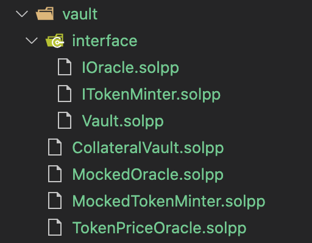

# Common Patterns

In this chapter, we will cover the common patterns of Vite smart contract development with an example.

## A Well-Structured Vite Smart Contract

The following contract comes from a collateral vault that accepts Vite coins, and in turn, mints a stablecoin VUSD.

```solidity
// SPDX-License-Identifier: MIT
pragma soliditypp >=0.8.0;
pragma experimental Await;

import "./interface/Vault.solpp";
import "./interface/ITokenMinter.solpp";
import "./interface/IOracle.solpp";
import "../openzeppelin/access/Ownable.sol";

contract CollateralVault is Vault, Ownable {

    vitetoken constant VITE_TOKEN = "tti_5649544520544f4b454e6e40";
    uint8 constant VITE_DECIMALS = 18;
    vitetoken constant STABLE_TOKEN = "tti_80f3751485e4e83456059473";
    uint8 constant VUSD_DECIMALS = 6;

    IOracle oracle;
    // the built-in token issuance contract
    ITokenMinter tm = ITokenMinter("vite_000000000000000000000000000000000000000595292d996d");

    /// @param _oracleAddress The price oracle contract
    /// @param _tmAddress The token manager contract
    constructor(address _oracleAddress, address _tmAddress) payable {
        collateralToken = VITE_TOKEN;
        stableToken = STABLE_TOKEN;
        oracle = IOracle(_oracleAddress);
        if (_tmAddress != address(0)) {
            tm = ITokenMinter(_tmAddress);
        }
    }

    /// @notice Allows the owner to set a new oracle
    /// @param _oracleAddress The new price oracle contract to be set
    function setOracle(address _oracleAddress) public onlyOwner {
        oracle = IOracle(_oracleAddress);
    }

    /// @notice Allows the owner to set a new token minter
    /// @param _tmAddress The new token minter contract to be set
    function setTokenMinter(address _tmAddress) public onlyOwner {
        tm = ITokenMinter(_tmAddress);
    }

    /// @notice Allows a user to deposit VITE in exchange for some amount of VUSD
    /// @param _depositAmount  The amount of VITE the user sent in the transaction
    function deposit(uint256 _depositAmount) override payable external {
        require(VITE_TOKEN == msg.token, "incorrect deposit token");
        require(_depositAmount == msg.value, "incorrect deposit amount");

        vaults[msg.sender].collateralAmount += _depositAmount;
        // estimate mint amount
        uint256 amountToMint = getMintAmount(_depositAmount);
        // mint stable coins, the minted token will be sent to msg.sender
        await tm.ReIssue(STABLE_TOKEN, amountToMint, payable(msg.sender));
        vaults[msg.sender].debtAmount += amountToMint;

        emit Deposit(_depositAmount, amountToMint);
    }
    
    /// @notice Allows a user to withdraw up to 100% of the VITE collateral they have on deposit
    /// @param _repayAmount  the amount of VUSD that a user is repaying to redeem their collateral for.
    function withdraw(uint256 _repayAmount) override payable external {
        require(STABLE_TOKEN == msg.token, "incorrect repay token");
        require(_repayAmount == msg.value, "incorrect repay amount");
        require(_repayAmount <= vaults[msg.sender].debtAmount, "withdraw limit exceeded"); 

        vaults[msg.sender].debtAmount -= _repayAmount;
        // estimate withdraw amount
        uint256 amountToWithdraw =  getWithdrawAmount(_repayAmount);
        // burn repaid stable coins
        await tm.Burn{token: STABLE_TOKEN, value: _repayAmount}();
        vaults[msg.sender].collateralAmount -= amountToWithdraw;
        // send VITE to msg.sender
        payable(msg.sender).transfer(VITE_TOKEN, amountToWithdraw);

        emit Withdraw(amountToWithdraw, _repayAmount);
    }
    
    /// @notice Returns an estimate of how much collateral VITE could be withdrawn for a given amount of VUSD
    /// @param _repayAmount  the amount of VUSD that would be repaid
    /// @return withdrawAmount the estimated amount of a vault's collateral VITE that would be returned 
    function getWithdrawAmount(uint256 _repayAmount) override view public returns(uint256 withdrawAmount) {
        // get price from oracle
        (uint256 price, uint8 decimals) = await oracle.getLatestPrice();
        return _repayAmount * 10**(VITE_DECIMALS + decimals) / (price * 10**VUSD_DECIMALS);
    }
    
    /**
     * @notice Returns an estimate on how much VUSD could be minted at the current rate
     * @param _depositAmount the amount of VITE that would be deposited
     * @return mintAmount  the estimated amount of VUSD that would be minted
     */
    function getMintAmount(uint256 _depositAmount) override view public returns(uint256 mintAmount) {
        (uint256 price, uint8 decimals) = await oracle.getLatestPrice();
        // get price from oracle
        return _depositAmount * price * 10**VUSD_DECIMALS / 10**(VITE_DECIMALS + decimals);
    }
}
```

The contract inherits `Vault.solpp` and `openzeppelin/access/Ownable.sol`. As an abstract contract, `Vault.solpp` defines the base functions and the data structure of the vault. `Ownable.sol` is a standard OpenZeppelin contract of Solidity, which is imported into the collateral contract without change. The contract also declares two interface fields `IOracle.solpp` and `ITokenMinter.solpp`, corresponding to a price oracle and a token minter - they will be instantiated during deployment. When the contract is in actual use, the token minter should be the Vite's token issuance contract, and the oracle is assigned with the contract address of `TokenPriceOracle.solpp`. We simply replace with `MockOracle.solpp` and `MockTokenMinter.solpp` in our example for demo purpose and testing.

`MockOracle.solpp` returns a fixed price, and `MockTokenMinter.solpp` maintains an amount of pre-minted VUSD tokens and sends to certain address when it is called. 

The contract's directory structure is as below.

<br>
<div style="height:15em; display: flex; justify-content: space-between;">
<div style="float:left;height:100%;margin:0 auto; text-align:center; box-shadow: 0 4px 8px 0 rgba(0, 0, 0, 0.2), 0 6px 20px 0 rgba(0, 0, 0, 0.19);"><br>Contract directory structure</div>
</div>
<br><br><br>

## Using Solidity Code

Most Solidity code can be directly used in Solidity++ without any change. This also applies to most contracts in OpenZeppelin library except the "ERCxxx" token contracts in Ethereum. In the example, CollateralVault extends `Ownable.sol` so that the `onlyOwner` modifier can be used in the contract. `Ownable.sol` is an standard OpenZeppelin contract written in Solidity.

!!! tip
    Vite implements a native token issuance model. Issuing or minting a new token doesn't need a "Token Contract" as in Ethereum.

```solidity
/// @notice Allows the owner to set a new oracle
/// @param _oracleAddress The new price oracle contract to be set
function setOracle(address _oracleAddress) public onlyOwner {
    oracle = IOracle(_oracleAddress);
}
```

## How to Transfer Tokens

In the example, the contract sends an amount of `amountToWithdraw` VITE tokens to `msg.sender`, which is the caller of the `withdraw` function. `msg.sender` must be `payable` in order to receive funds. 

```solidity
// send VITE collateral to msg.sender
payable(msg.sender).transfer(VITE_TOKEN, amountToWithdraw);
```

> Note: The syntax of sending token to another address is `address.transfer(_tti, _amount)`

## Using Implicit Receive Function

`MockedTokenMinter.solpp` has defined a default (implicit) receive function, which allows others send tokens to the contract. Note that the receive function doesn't have any parameters and must be declared as `payable`.

> Note: Solidity++ contract doesn't have a default receive function. The contract cannot receive transactions - any token sent to the contract will be returned. Always add the receive function if your contract needs to receive tokens.

```solidity
// SPDX-License-Identifier: MIT
// SPDX-License-Identifier: MIT
pragma soliditypp >=0.8.0;

import "./interface/ITokenMinter.solpp";

contract MockedTokenMinter is ITokenMinter {

    vitetoken constant VUSD = "tti_80f3751485e4e83456059473";

    /// implicit receive function
    receive() external payable {
        require(VUSD == msg.token);
    }

    /// @notice Mint a given amount of token and send to the recieve address
    /// @dev Instead of actually mint the token upon request, the tokens will be pre-minted and stored in this mock
    /// @param tokenId The token to be minted
    /// @param amount The token amount to be minted
    /// @param receiveAddress The recipient address which the minted token will be sent to
    function ReIssue(vitetoken tokenId, uint256 amount, address payable receiveAddress) override external {
        require(balance(VUSD) >= amount);
        require(VUSD == tokenId);
        // transfer token to the receive address
        receiveAddress.transfer(tokenId, amount);
        emit Minted(tokenId, amount);
    }

    /// @notice Burn token
    /// @dev Instead of acutally burn the token, the tokens sent with this function will be stored in this mock
    function Burn() override payable external {
        require(VUSD == msg.token);
        emit Burned(msg.token, msg.value);
    }
}
```

## How to Call Another Contract

`CollateralVault` calls the price oracle contract to obtain the current price. For example, `await oracle.getLatestPrice()` calls the `getLatestPrice()` function on the oracle and returns the price. The `await` operator indicates the call is synchronous. The execution will pause until the price is returned from the oracle. 

!!! warning "Await operator and Solidity"
    The `await` operator is introduced in Solidity++ v0.8.1. It is a powerful tool that makes synchronous-like calls on Vite possible. Basically, it behaves similarly to a function call in Ethereum, and gives the same execution result. However, due to the asynchronous nature of Vite, in some execution context it might give unexpected results (compared to that in Ethereum). We will explain these pitfalls in the next chapter. 

```solidity
function getMintAmount(uint256 _depositAmount) view override returns(uint256 mintAmount) {
    // get price from oracle
    (uint256 price, uint8 decimals) = await oracle.getLatestPrice();
    return _depositAmount * price * 10**VUSD_DECIMALS / 10**(VITE_DECIMALS + decimals);
}
```

Before the `await` operator is introduced, all the contract call on Vite is asynchronous. They will return immediately and the Vite VM will start execute the next line of code. In the example, if we remove `await`, `oracle.getLatestPrice()` will become an async call, and the next line `return _depositAmount * price * 10**VUSD_DECIMALS / 10**(VITE_DECIMALS + decimals)` will start to run with an invalid price (apparently not the expected behavior for our example).

> Note: The syntax of calling another contract is `contract.f(_params)`. If you want to make it synchronous, simply adding `await` ahead, i.e. `await contract.f(_params)`.

## How to Transfer Tokens when Calling Another Contract

After received VUSD repayment, the `withdraw` function burns the tokens by calling `await tm.Burn{token: STABLE_TOKEN, value: _repayAmount}()`. This calls the `Burn` function on TokenMinter contract and sends the tokens for burning. 

> Note: The syntax is `contract.f{token: _vitetoken, value: _amount}(_params)`. The function must be `payable`. 

## Using Libraries(OpenZeppelin)

Using OpenZeppelin library is also possible in Solidity++. Let us modify the `CollateralVault.solpp` contract to use the library `SafeMath.sol`.

Same as what need to be done in Solidity, We add an new import and declare to use the library in the contract.

```solidity
// SPDX-License-Identifier: MIT
pragma soliditypp >=0.8.0;

import "./interface/Vault.solpp";
import "./interface/ITokenMinter.solpp";
import "./MockOracle.solpp";
import "../openzeppelin/access/Ownable.sol";
import "../openzeppelin/utils/math/SafeMath.sol";

contract CollateralVault is Vault, Ownable {

    using SafeMath for uint;
    
    // other code of the contract...

    function getMintAmount(uint256 _depositAmount) view override returns(uint256 mintAmount) {
        (uint256 price, uint8 decimals) = await oracle.getLatestPrice();
        // get price from oracle
        return _depositAmount.mul(price).mul(10**VUSD_DECIMALS).div(10**(VITE_DECIMALS.add(decimals)));
    }
}
```

We modified `getMintAmount(uint256 _depositAmount)` by replacing the original math operations with functions provided in the library.
