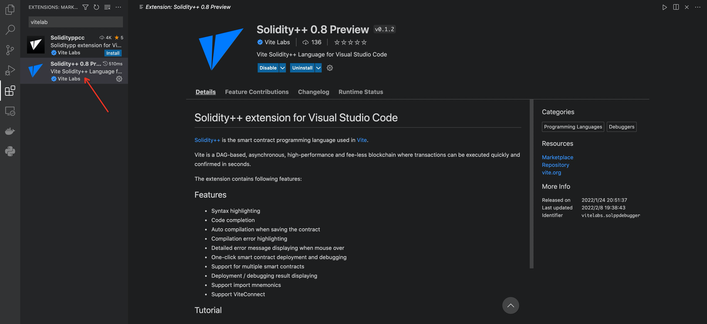
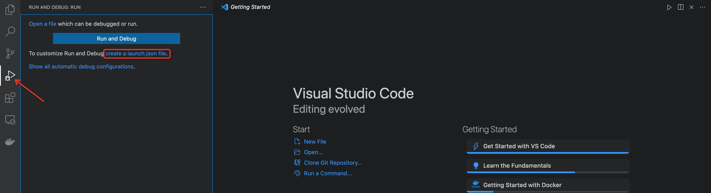
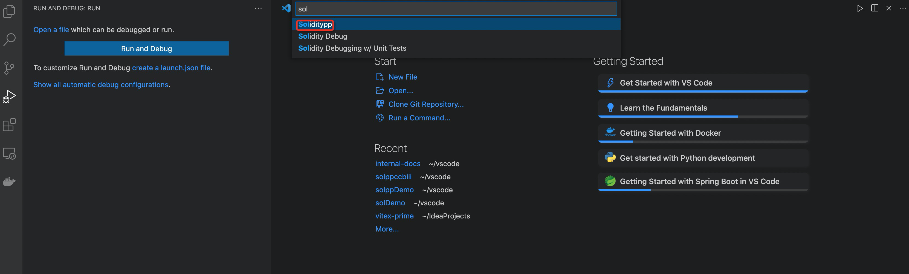
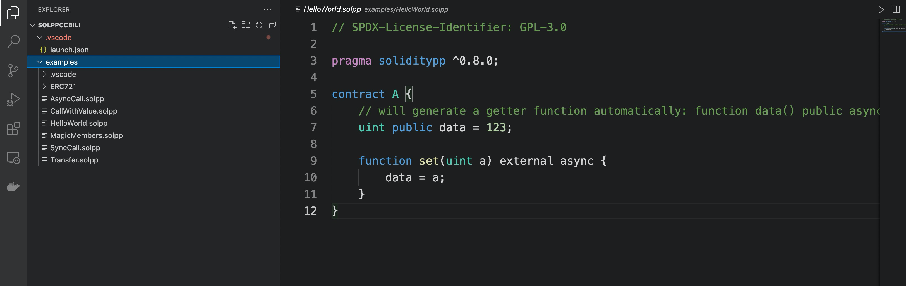
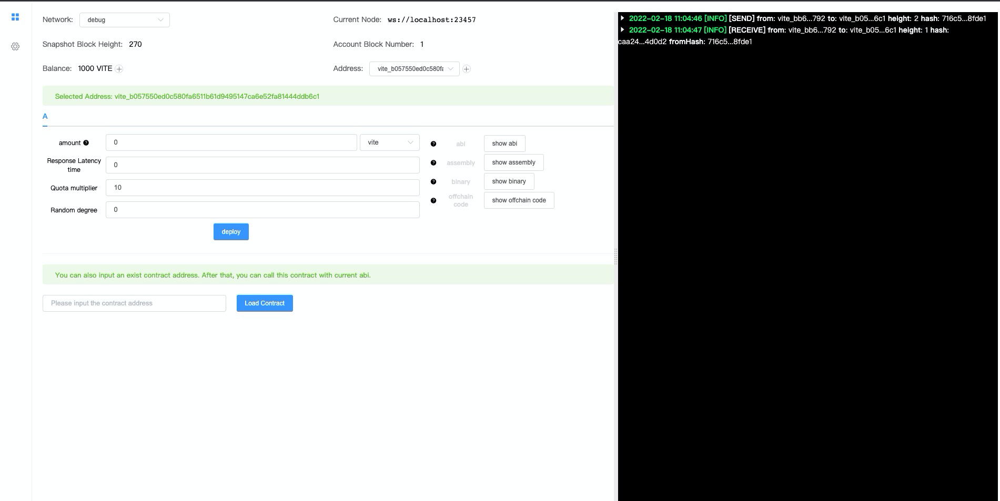
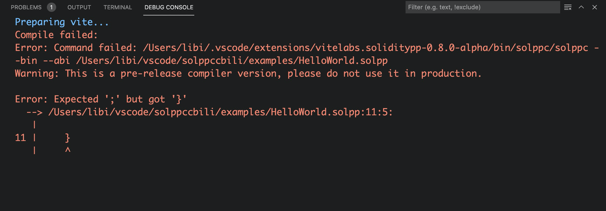
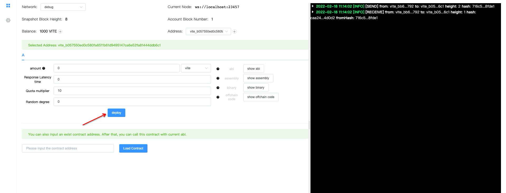
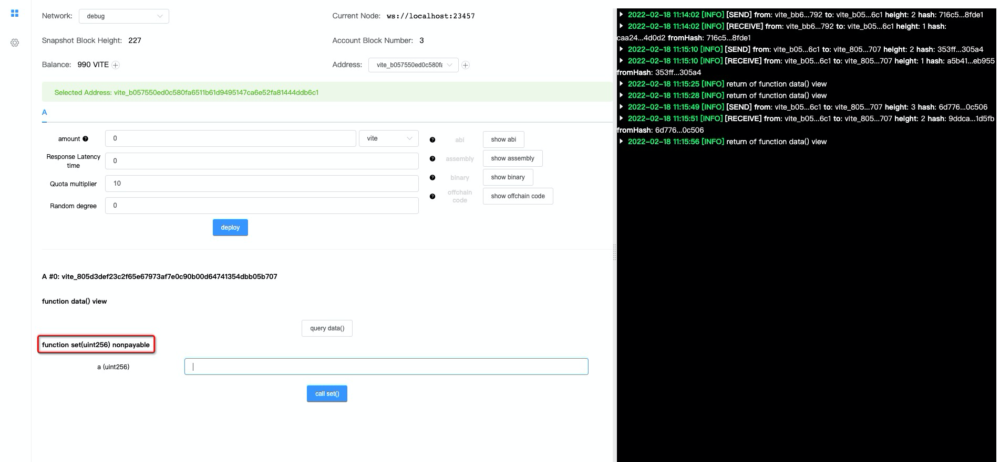
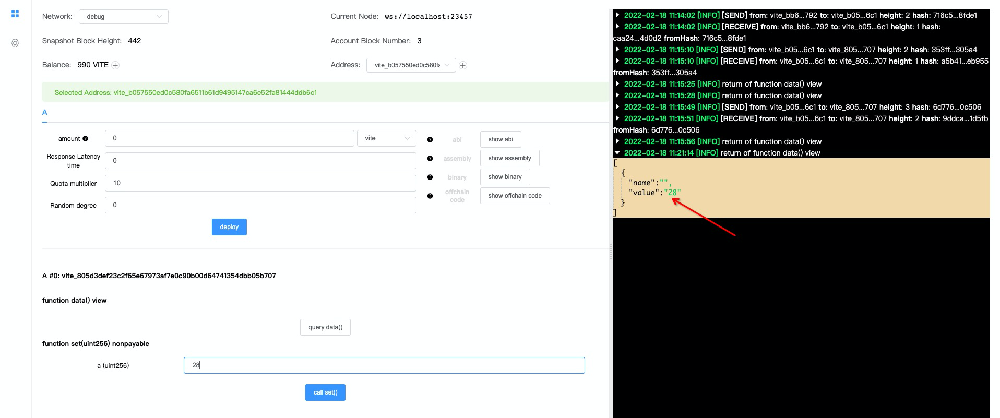

# How to Use

The recommended development environment for Solidity++ is Visual Studio Code with the Soliditypp extension, which includes a latest version of Vite node, a `solppc` compiler and debugging environment. 

## Install
Download and install [Visual Studio Code](https://code.visualstudio.com/)

Launch VSCode, navigate to the **Extensions** panel and search for "soliditypp", install the **Solidity++ 0.8 Preview** extension.


That's it! Now you can proceed to test your environment by deploying a contract.

!!! tip "Legacy Extension"
    At current time, two versions of solidity++ extension will be returned. If you are working with a 0.4.x Solidity++ contract, install **Solidityppcc**.

## Write Contract

First create or specify a folder for your Solidity++ project.

Open the debug panel, and click on `create a launch.json file` link. 

Then choose **"Soliditypp"** for the environment.This automatically generates a `launch.json` file which is used by VSCode to configure the debugger.


Create a new file named `HelloWorld.solpp` and type in the following code:

```solidity
// SPDX-License-Identifier: GPL-3.0
pragma soliditypp >=0.8.0;

contract HelloWorld {
    uint public data = 123;

    function set(uint a) external {
        data = a; 
    }
}
```

The contract has a `set` function setting an input value `a` to public state field `data`.

!!! note
    Public field can be visited with an implicit view function in the same name. 

!!! example
    The legacy extension provides a command to generate a `HelloWorld.solpp` contract by pressing `⇧⌘P` (on Mac) or `Ctrl+Shift+P` (on Windows) to open the Command Palette, then choosing the command `>soliditypp: Generate HelloWorld`. This has been replaced by `>soliditypp: Generate Examples` in extension Solidity++ 0.8.
    
You can also fetch the examples from https://github.com/vitelabs/soliditypp-examples

## Debugging
Launch the debugger by pressing `F5`. This will automatically compile the contract and launch a debugger browser window. 

!!! note
    The extension will download `gvite` node for the first launch, stay patient!



!!! tip "Compiling Errors"
    If the debugger interface doesn't launch, check the debug console for any errors.

    

!!! tip "Gvite Version"
    Since 0.2.5, it's possible to specify the gvite release version by adding `gviteVersion` in launch.json in your working directory as below.

    ```json
    {
        "version": "0.2.0",
        "configurations": [
            {
                "type": "soliditypp",
                "request": "launch",
                "name": "Soliditypp Debug",
                "program": "${file}",
                "gviteVersion": "v2.12.0-nightly-202204012212"
            }
        ]
    }
    ```

## Deployment

To deploy your contract to the local (debug) node, simply hit on **Deploy** as shown below. There are several options available, let's use the default values here.



When the contract is deployed, a contract address will be displayed. We can call the contract now. 

The right side of the window shows the execution result logs.



Let's choose the function `set` and feed an integer, then click on the **call set()** button. When the log shows the "[RECEIVE]" transaction has been executed, hit the **query data()** button to check if the data field has been updated.


Congratulations! You've deployed and tested your first Solidity++ contract!
