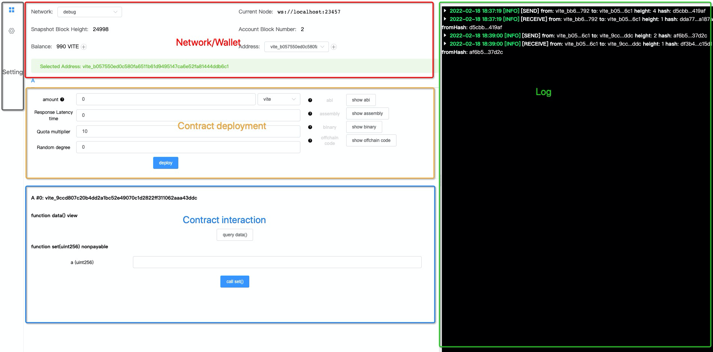
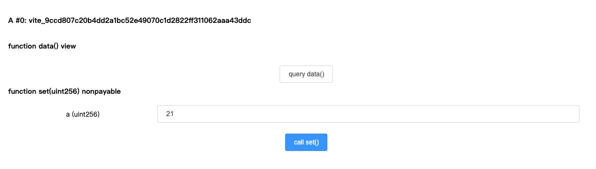

# Know More about the Debugger

> Before reading this section, please make sure you have completed the steps in ["How to use IDE"](README.md).

## Start / Stop the Debugger

* **Start:** Press `F5` in VSCode to launch the debugger. This will compile your current contract and load the debugging interface in a browser window. 

!!! note
    The extension has a local `gvite` node. Selecting "debug" in the network dropdown list to use this node.

* **Stop:** Press `Shift+F5` in VSCode to stop the debugger.

!!! warning
    Please note that all the contracts deployed will be cleaned up on the local debug node after the debugger is stopped.

## Layout

The debugger UI has several areas.

### Network/Wallet

* **Network**: Select where the contract will be deployed to. Currently supports `debug`, `testnet`, `mainnet`, and `custom`.

> `custom` is added in **Solidity++ 0.8**, which allows to use a customized node.

* **Current Node**: Shows the current connected network's RPC endpoint.
!!! tip
    you can add this endpoint into the desktop wallet's network setting to send or receive transactions on the node.

* **Snapshot Block Height**: Shows the snapshot block height for the connected network. The local `debug` network will start at 1 each time the debugger is launched.

* **Account Block Number**: Shows the current address's block height.

* **Balance**: Shows the balance of the current address. On the `debug` network the address will be initially provided 1,000 VITE. Hitting the `⊕` button will supply 1,000 VITE to the address each time. 

* **Address/Selected Address**: Shows the current address used for contract deployment and debugging. Click on `⊕` button to to use a different address.

## Contract Deployment

* **Contract Selection**: Select the contract that has been deployed. If the `.solpp` file has more than one contracts, all of them will be displayed here.

* **amount**: Send a certain amount of token to the contract upon deployment.

!!! note
    The contract constructor ***must*** be `payable` to accept token transfer on deployment. Otherwise the deployment will fail.

* **Response Latency Time**: 
This parameter specifies the required confirmation depth (i.e. number of snapshot blocks) on any request transaction before the deployed contract will send a response transaction. This value ranges from 0 to 75, where 0 means there is no waiting period and respond block will be produced immediately.

!!! note
    Larger response latency means slower contract response

!!! tip 
    If the contract uses timestamp, snapshot block height, or random numbers, this parameter ***must*** be above 0. 

* **Quota multiplier**: This parameter modifies the amount of quota consumed by all request transactions that call the contract. Quota charged on the contract's response transactions are not affected. The Quota multiplier has a range from 10 to 100, which corresponds to a range of 1x to 10x quota consumption. For example, a value of 15 means that the requested transaction to the contract uses 1.5x the default rate.

* **Random degree**: The number of snapshot blocks having random seed by which request sent to this contract is confirmed before responding to the specific transaction. Value range is 0-75. 0 indicates that there is no waiting for the request transaction to be included in a snapshot block that contains random number. If any random number related instruction is used in the contract, the value must be above 0. 
> In general, the larger the value, the more secure the random number. This parameter must be no greater than response latency.

* **show abi**: Shows the contract's abi specification in JSON. It is important to have this information to call any deployed contract.

* **show binary**: Shows the contract's compiled binary code.

* **show offchain code**: Shows the contract's compiled offchain code. 

!!! note
    offchain (getter) function has been deprecated in Solidity++ 0.8. Developer should use `query` function to access the public fields of the contract.

### Interact with Contract

This area will only appear after the contract has been deployed or loaded, and is used to call functions on a given contract.

!!! tip "Load an existing contract"
    You can load a previously deployed contract by filling in the address and hit the "Load Contract" button. This is very useful to load an old contract deployed on the testnet or mainnet.

* **Contract Name/Address**: Shows the address of deployed contracts.

* **Parameters**: Shows the input parameters of the deployed contract.

### Log

The log area shows the details of `Send` or `Receive` transactions for the current address. In general, a `Send` transaction corresponds the request to call the contract and `Receive` transaction is the execution.

!!! note
    If your contract emits `Event`, the event can be found in the corresponding `Receive` transaction. 

## Debugger Settings

* **Mnemonic Words**: Shows the mnemonic phrase that are used to generate the wallet addresses in the extension.

!!! danger "Do NOT use your primary wallet for testing"
    Keep your wallet's mnemonic words safe. Do NOT use your primary wallet (that have large funds in the mainnet or any wallet you will use normally in the web/desktop/app wallet) for debugging/testing purpose. You should generate a separate test wallet or use Vite Connect(on mainnet). 

* **Vite Connect**: Instead of using the local wallet generated from mnemonic words, this option allows to use ViteConnect to connect a wallet in the Vite Wallet app.

> Vite Connect is a safer approach which signs a transaction using private keys secured on the wallet app. The wallet's keys will never be sent to the website. All transactions must be confirmed and signed on the Vite Wallet app. 
