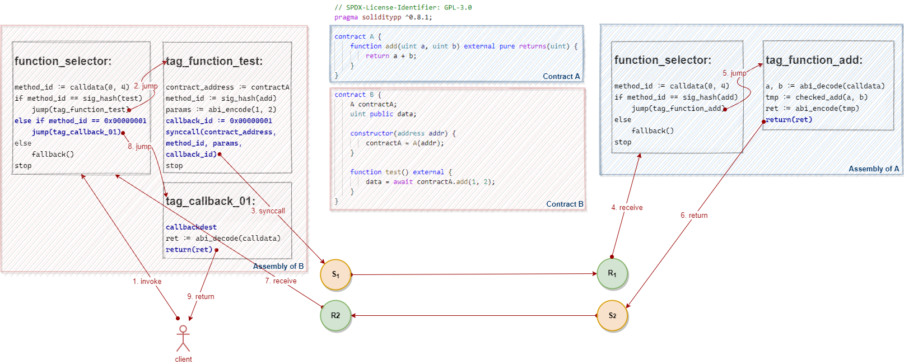

# Await Operator

We covered the `await` operator in chapter [Promise and Await](../fundamentals/promise-await.md). Let us look at how it is implemented in Vite.

## Design Objectives

Let's see a piece of code to know what specific work needs to be done by the compiler and VM:


In summary, there are the following tasks:
* To generate callback entries for each synchronous call automatically at compile time.
* To initiate a callback request when the result is returned.
* To maintain execution context during function invocations and callbacks.

## Solidity Compiler and EVM

Before starting, let's take a look at the output from Solidity compiler for an example.

Pseudo assembly code for contract `A`:
```
function_selector:
method_id := calldata(0, 4)
if method_id == sig_hash(add)
    jump(tag_function_add)
else
    fallback()
stop

tag_function_add:
a, b := abi_decode(calldata)
tmp := checked_add(a, b)
ret := abi_encode(tmp)
return(ret)
```

Pseudo assembly code for contract `B`:
```
function_selector:
method_id := calldata(0, 4)
if method_id == sig_hash(test)
    jump(tag_function_test)
else
    fallback()
stop

tag_function_test:
contract_address := contractA
method_id := sig_hash(add)
params := abi_encode(1, 2)
call(contract_address, method_id, params)
ret := abi_decode(returndata)
data = ret
return
```

I use an anatomy diagram to show the control flow:


As shown by the red arrows in the diagram, the EVM executes external function calls through the `call` and `return` instructions.

The Solidity compiler will create a piece of code called *function selector* for each contract that includes the entries to interface functions of the contract at compile time.

When executing a message call to a contract, EVM extracts the first four bytes from *calldata* and compare against the method id of each function, then jump to the definition of a corresponding function and keep executing if they match. Otherwise, jump to the fallback function either defined by user or automatically created by the compiler.

When the `call` instruction gets executed, the EVM will retrieve the callee's address and load the callee’s code from the address and execute the code in an independent context.

When the `return` instruction gets executed, the EVM will place the result of the execution into the memory and exits from the callee's code, and then keep executing the remaining code of the caller.

## Solidity++ Compiler

Now let's try to extend the functionality of the Solidity compiler, and introduce the following new features:

* To generate a callback entry, the compiler needs to traverse all `await` expressions in the contract at compile time, add a tag to each position immediately after the `await`, and add it to the function selector as a callback entry.
* To initiate a callback request when the result is returned, we need to re-implement the `return` instruction in the Vite VM to initiate a send transaction with type of `SendCallback`.
* To maintain execution context, two new instructions `synccall` and `callbackdest` need to be introduced into the Vite VM. 

The compiler places a `synccall` instruction at each synchronous call. When the VM executes the `synccall` instruction, it initiates a send transaction with type of `SendSyncCall` and persists the execution context into the local database.

Similarly, the compiler places a `callbackdest` instruction at each callback. When the VM executes the `callbackdest` instruction, it restores the execution context from the local database and then resumes execution.

This design allows the compiler to generate code that can run on an asynchronous VM for contracts written in a programming language similar to Solidity.

The example will be compiled to the following code:

Pseudo assembly code for contract `A`:
```
function_selector:
method_id := calldata(0, 4)
if method_id == sig_hash(add)
    jump(tag_function_add)
else
    fallback()
stop

tag_function_add:
a, b := abi_decode(calldata)
tmp := checked_add(a, b)
ret := abi_encode(tmp)
return(ret)
```

Pseudo assembly code for contract `B`:
```
function_selector:
method_id := calldata(0, 4)
if method_id == sig_hash(test)
    jump(tag_function_test)
<strong>else if method_id == 0x00000001
    jump(tag_callback_01)</strong>
else
    fallback()
stop

tag_function_test:
contract_address := contractA
method_id := sig_hash(add)
params := abi_encode(1, 2)
<strong>callback_id := 0x00000001
synccall(contract_address, method_id, params, callback_id)</strong>
stop

<strong>tag_callback_01:
callbackdest
ret := abi_decode(calldata)
return(ret)
```

Again, let's put these in an anatomy diagram:



The assembly code in blue is generated by the Solidity++ compiler specifically for the Vite VM.

The orange and green circles represent the *send* (*request*) transaction and *receive* (*response*) transaction initiated by the Vite VM, respectively.

As we can see, the compiler translates each `await` expression into a set of instructions in the same pattern: inserting a `synccall` instruction, a `stop` instruction, a jump dest tag (a `jumpdest` instruction), and a `callbackdest` instruction.

Essentially, the Vite VM treats the `synccall` instruction as an *interrupt*, which is a request for the VM to interrupt currently executing code, save its context, and initiate an asynchronous request transaction.

Correspondingly, before receiving a callback and resuming execution, the execution context needs to be restored by executing the `callbackdest` instruction.

This pattern is known as *context switch*. In a multi-task system, it refers to the process of storing the system state for a task, so that task can be paused and resumed later.
