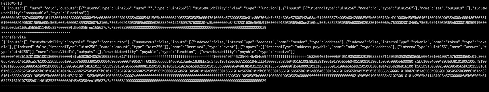
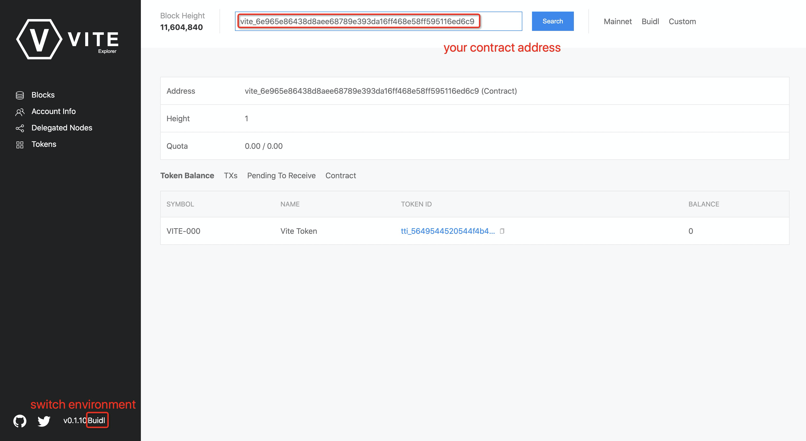

# Vuilder Kit

[Vuilder](https://github.com/vitelabs/vuilder) is the Solidity++ smart contract development kit to help developers reduce complexity of compilation, library linking, testing, and deployment of the contract. Vuilder has the following common commands:

```
npx vuilder node  // start a local gvite node
npx vuilder compile // compile contract
npx vuilder test  // test contract
npx ts-node deploy.ts  // execute a ts file 
```

The following sections show how to use Vuilder with an example.

## Create a Vuilder Project

Execute the command to create a typescript project.

```bash
mkdir vuilder-demo && cd vuilder-demo
npm init -y && npm i typescript --save-dev && npx tsc --init --resolveJsonModule true
npm install ts-node @types/node @vite/vuilder chai mocha @types/chai @types/mocha
```

## Compile Contract 

Let's create two sample contracts and save to `contracts` subfolder. Create the subfolder if it doesn't exit.

```bash
mkdir contracts
vim contracts/HelloWorld.solpp
```

```solidity
// SPDX-License-Identifier: GPL-3.0
pragma soliditypp >=0.8.0;

contract HelloWorld {
    uint public data = 123;

    function set(uint a) external {
        data = a; 
    }
}
```

```bash
vim contracts/transfer.solpp
```

```solidity
// SPDX-License-Identifier: GPL-3.0
// Demonstrate how to transfer tokens from / to a contract.

pragma soliditypp >=0.8.0;

contract TransferVite {
   event Received(address sender, vitetoken token, uint amount);

   constructor() payable {}

   // Receive Token function
   receive() external payable {
      address sender = msg.sender;
      vitetoken token = msg.token;
      uint amount = msg.value;

      emit Received(sender, token, amount);
   }

   function sendViteTo(address payable addr, uint amount) external payable {
      // send VITE to `addr`
      addr.transfer("tti_5649544520544f4b454e6e40", amount);
   }
}
```

Compile the contract

```bash
npx vuilder compile HelloWorld.solpp
npx vuilder compile transfer.solpp
```

It should show that the compilation is successful



## Testing

Set up local network and test account

```bash
mkdir test
vim test/vite.config.json
```

> The settings below should not be modified due to the mnemonic phrase for local network has been set up by default.

```json
{
  "networks": {
    "local": {
      "http": "http://127.0.0.1:23456/",
      "ws": "http://127.0.0.1:23457/",
      "mnemonic": "record deliver increase organ subject whisper private tourist final athlete unit jacket arrow trick sweet chuckle direct print master post senior pluck whale taxi"
    }
  }
}
```

Write test cases in `HelloWorld.spec.ts`

```bash
vim test/HelloWorld.spec.ts
```

```js
import { expect } from "chai";
const vuilder = require("@vite/vuilder");
import config from "./vite.config.json";

let provider: any;
let deployer: any;

describe("test HelloWorld", () => {
  before(async function() {
    provider = vuilder.newProvider(config.networks.local.http);
    console.log(await provider.request("ledger_getSnapshotChainHeight"));
    deployer = vuilder.newAccount(config.networks.local.mnemonic, 0, provider);
    console.log('deployer', deployer.address);
  });

  it('test set function', async () => {
    // compile
    const compiledContracts = await vuilder.compile('HelloWorld.solpp');
    expect(compiledContracts).to.have.property('HelloWorld');

    // deploy
    let helloWorld = compiledContracts.HelloWorld;
    helloWorld.setDeployer(deployer).setProvider(provider);
    await helloWorld.deploy({});
    expect(helloWorld.address).to.be.a('string');
    console.log(helloWorld.address);

    // check default value of data
    let result = await helloWorld.query('data', []);
    console.log('return', result);
    expect(result).to.be.an('array').with.lengthOf(1);
    expect(result![0]).to.be.equal('123');

    // call HelloWorld.set(456);
    await helloWorld.call('set', ['456'], {});

    // check value of data
    result = await helloWorld.query('data', []);
    console.log('return', result);
    expect(result).to.be.an('array').with.lengthOf(1);
    expect(result![0]).to.be.equal('456');
  });
});
```

Write test cases in `transfer.spec.ts`

```bash
vim test/transfer.spec.ts
```

```js
import { describe } from "mocha";
import { expect } from "chai";
import * as vuilder from "@vite/vuilder";
import config from "./vite.config.json";

let provider: any;
let deployer: vuilder.UserAccount;

describe('test transfer', () => {
  before(async function() {
    provider = vuilder.newProvider(config.networks.local.http);
    console.log(await provider.request("ledger_getSnapshotChainHeight"));
    deployer = vuilder.newAccount(config.networks.local.mnemonic, 0, provider);
    console.log('deployer', deployer.address);
  });

  it('test contract', async () => {
    // compile
    const compiledContracts = await vuilder.compile('transfer.solpp');
    expect(compiledContracts).to.have.property('TransferVite');
    
    // init user accounts
    const alice = vuilder.newAccount(config.networks.local.mnemonic, 1, provider);
    console.log('alice', alice.address);
    const bob = vuilder.newAccount(config.networks.local.mnemonic, 2, provider);
    console.log('bob', bob.address);
    await deployer.sendToken(alice.address, '200');
    await alice.receiveAll();
    await deployer.sendToken(bob.address, '100');
    await bob.receiveAll();

    // deploy
    let transferVite = compiledContracts.TransferVite;
    transferVite.setDeployer(deployer).setProvider(provider);
    await transferVite.deploy({tokenId: 'tti_5649544520544f4b454e6e40', amount: '600'});
    expect(transferVite.address).to.be.a('string');
    console.log(transferVite.address);

    let balanceA = await transferVite.balance();
    expect(balanceA).to.be.equal('600');

    // Alice sent 50 to the contract A
    const block = await alice.sendToken(transferVite.address, '50');

    await vuilder.utils.waitFor(() => {
      return vuilder.isReceived(provider, block.hash);
    }, "Wait for receiving token");

    // check balance of A
    balanceA = await transferVite.balance();
    // console.log('balance of A:', balanceA);
    expect(balanceA).to.be.equal('650');

    // check events of A
    let events = await transferVite.getPastEvents('Received', {fromHeight: 0, toHeight: 0});
    expect(events[0]?.returnValues?.sender).to.be.equal(alice.address);
    expect(events[0]?.returnValues?.token).to.be.equal('tti_5649544520544f4b454e6e40');
    expect(events[0]?.returnValues?.amount).to.be.equal('50');

    // check balance of Alice
    let balanceAlice = await alice.balance();
    // console.log('balance of Alice:', balanceAlice);
    expect(balanceAlice).to.be.equal('150');

    // Alice call contract A.sendViteTo() to send token to Bob
    await transferVite.call('sendViteTo', [bob.address, 30], {caller: alice, amount: "100"});

    // check balance of Bob before receiving
    let balanceBob = await bob.balance();
    // console.log('balance of Bob:', balanceBob);
    expect(balanceBob).to.be.equal('100');

    // Bob recevie the money
    await bob.receiveAll();

    // check balance of Bob after receiving
    balanceBob = await bob.balance();
    // console.log('balance of Bob:', balanceBob);
    expect(balanceBob).to.be.equal('130');

    // check balance of A
    balanceA = await transferVite.balance();
    // console.log('balance of A:', balanceA);
    expect(balanceA).to.be.equal('720');
  });
});
```

Run the test script and watch results.

```
npx vuilder test
```

!!! tip
    For more examples, please refer to [soliditypp-examples](https://github.com/vitelabs/soliditypp-examples)

## Deployment

Congratulations! All the tests have passed, we can deploy the contract on the blockchain now.

Create a `deploy.config.json` file specifying the deployment environment and a mnemonic phrase. Here we deploy the contract in the testnet.

```bash
mkdir scripts
vim scripts/deploy.config.json
```

```json
{
  "http": "https://buidl.vite.net/gvite",
  "mnemonic": "your mnemonic phrase"
}
```

Write deployment script

```bash
vim scripts/deploy.ts
```

```js
import { expect } from "chai";
import * as vuilder from "@vite/vuilder";
import config from "./deploy.config.json";

async function run(): Promise<void> {
  const provider = vuilder.newProvider(config.http);
  console.log(await provider.request("ledger_getSnapshotChainHeight"));
  const deployer = vuilder.newAccount(config.mnemonic, 0, provider);

  // compile
  const compiledContracts = await vuilder.compile("HelloWorld.solpp");
  expect(compiledContracts).to.have.property("HelloWorld");

  // deploy
  let helloWorld = compiledContracts.HelloWorld;
  helloWorld.setDeployer(deployer).setProvider(provider);
  await helloWorld.deploy({});
  expect(helloWorld.address).to.be.a("string");
  console.log(helloWorld.address);
  
  return;
}

run().then(() => {
  console.log("done");
});
```

Run deploy script

```bash
npx ts-node scripts/deploy.ts
```

We can get the contract address on the console. 

!!! tip
  To ensure the contract is deployed successfully on the chain, you can check the address on a [Vite Explorer](http://viteview.xyz/).




