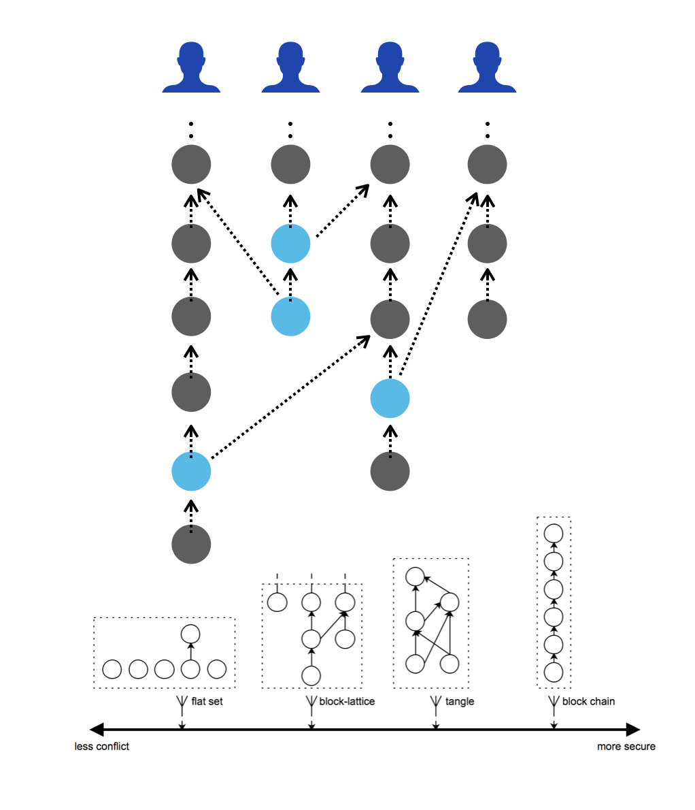

# Vite's DAG Ledger

The current state of any blockchain is the aggregate result of all transactions that have taken place in the network. The ledger is a record of all these transactions.

In a "typical" blockchain project, the ledger looks like a chain of blocks, as is the case with Bitcoin and Ethereum. Each later block references the hash of the previous block, and therefore any change to the data in an older block necessitates a change in the content of all subsequently chained blocks. This means anyone trying to change or remove a transaction in the past will need to modify the entire chain since then, and convince others in the network of the legitimacy of the new chain. The difficulty in doing so ensures the immutability of on-chain data.

Vite's DAG ledger was inspired by the block-lattice architecture of Nano. Instead of having only one chain recording all transactions, Vite allows each user (and each smart contract) to have its own chain of blocks. Each block contains only one transaction, and each block refers to the hash of a previous block.

The benefit of this design is that independent transactions can be recorded on the ledger simultaneously, thereby increasing the throughput of the network.

To further boost performance, each transaction is broken into two parts -- a "send" and a "response." After a send transaction is initiated, the receive transaction doesn't need to be initiated until the receiver keyholder is online. This will allow more transactions to be sent per second.

Note that this separation applies to both a simple payment (above) and a smart contract function call. In the latter case, a request is an invocation, and a response comes in the form of the execution of the code. A response transaction also needs to refer to the hash of the corresponding request transaction. As in the chart below, the ledger looks like a grid made-up of transactions interlinked with one another.

If an account owner attempts to doublespend, the offending transaction will not be included by the full nodes and the snapshot block producers (SBPs).

One might notice an inherent deficiency in security for this architecture. This is because transactions are organized by addresses, and each transaction is only attached to the account chain associated with the relevant address. Transactions generated by other addresses do not become the descendant of the previous transaction. Therefore, for some account chains, the probability to forge blocks won't become smaller with time. To address this issue, Vite invents [Snapshot Chain](snapshot-chain.md).
