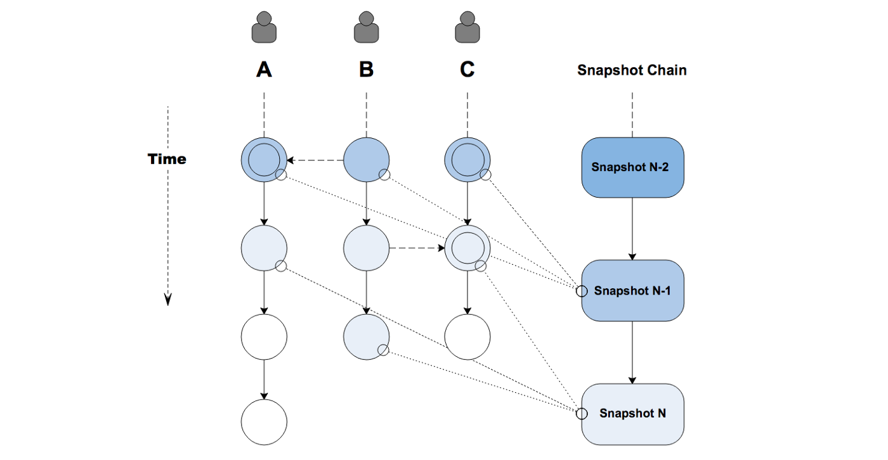

# Snapshot Chain

The Snapshot Chain was invented to address at least two deficiencies in the block-lattice ledger structure:

* In general, the security of a chain increases as it grows longer, because for any given transaction, the probability of a successful rollback drops with more and more blocks chained after said transaction. However, in a block-lattice ledger, each account chain stops growing if there are no new transactions involving the account owner.

* To prevent spamming attacks, the network needs to ration resources for transactions. To do so, the network must understand the amount of resources currently being consumed per account -- that is, the throughput of each account, measured by TPS (transactions-per-second). The block-lattice ledger lacks a global clock, thereby making it impossible to measure said TPS. Now, one way to throttle transactions is making every transaction compute PoW, but this just means every account will have the same quota for throughput. But even with the PoW, spamming can still happen with precomputed PoWs.

## What is Snapshot Chain

The Snapshot Chain is a chain of blocks (called "snapshot blocks"), each recording the balance of all accounts and the hash of the latest block in all account-chains. In a Delegated Proof-Of-Stake (DPoS) consensus algorithm, one node in a delegated nodes group ("consensus group") gets randomly selected to produce such a snapshot block in a given time period. This means when the selected node sees forks in any account-chain, it will deem one of the forks as correct and include it in the snapshot block.

## Transaction confirmations

A block in the account chains can be considered as confirmed as soon as it gets included in a snapshot block, or "snapshotted in the Snapshot Chain." Once a transaction is confirmed, it won't be rolled back even if the relevant user makes a longer fork on the account chain. When a transaction gets included in x number of blocks in the Snapshot Chain, then this transaction will be considered to have been confirmed x times by the network. The ability to forge blocks after a certain transaction becomes weaker with time. For most transactions, once the number of confirmations exceeds $(2/3 \times DelegateNodes + 1)$, the transaction can be considered valid and irreversible.

## A Global Clock

Since the Snapshot Chain provides a global ordering of all transactions, the height of each snapshot block can be effectively used as a timestamp for each transaction.

As shown in the above figure, the timestamp of Tn-1 is N-2, and the timestamp of Tn is N. The time elapsed between Tn and Tn-1 is N-(N-2)=2. So we have a throughput metric for each account. For a transaction with the height of n in the account-chain, the average TPS of the recent 10 transactions is:

$$TPS_n=\frac{10}{S\times(H_n-H_{n-9}+1)}$$

Here Hn is the height of the snapshot block referenced by transaction Tn, and S is the interval of two adjacent snapshot blocks, in seconds.

Now we can measure the TPS on account chains. As seen in another section, the [Quota](../quota/quota.md) mechanism is used to throttle transactions. So, the network will reject any transaction that spends more Quota than available.
