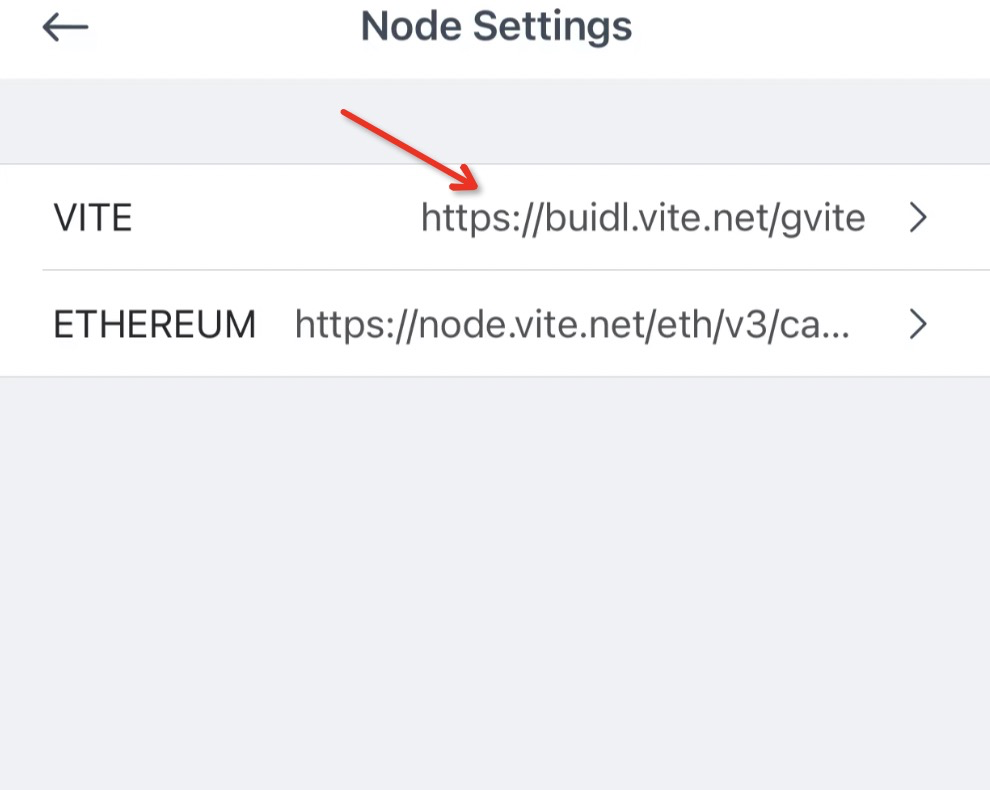

# Buy Me a Coffee

In this chapter, we will guide you to develop an entry-level dapp step by step using [Vite Express](https://github.com/vitelabs/vite-express) - the official Vite dapp template.

## Project Overview

The dapp is used to give people a way to express gratitude to someone else by "buying" them a coffee in the form of sending them VITE.

The dapp's main page will look like this:


## Running the Dapp From Scratch

In this section, we will show you how to set up the environment and build the dapp from existing code.

### Install Node.js

Node.js is a cross-platform, JavaScript runtime environment.

```bash
node -v // check node.js version
```

The node.js version used for this project is v14.18.1. We recommend using `nvm` to install and manage the node.js environment. 

Install `nvm` from https://github.com/nvm-sh/nvm.

```bash
curl -o- https://raw.githubusercontent.com/nvm-sh/nvm/v0.39.1/install.sh | bash
```

Now close the current terminal and start a new one

```
command -v nvm  // Check if the installation is successful
nvm ls-remote // Check available node.js versions 
nvm list // Check installed node.js versions 
nvm install v14.18.1 // Install node.js v14.18.1
```

### Get the Source Code

Get the source code with Git.

```bash
git clone https://github.com/vitelabs/vite-express
```

### Install Dependencies

This will install all dependencies according to `vite-express/package.json`.

```bash
cd vite-express
npm install 
```

### Test Contract with `Vuilder Kit`. 

**Vuilder** is a Solidity++ smart contract development kit designed for easy contract compilation, testing, and deployment in JavaScript. Refer to [Vuilder Kit](../soliditypp/Vuilder/README.md) for details.

Run the test with the following command:

```bash
npx vuilder test
```

### Set Up Wallet

Before deploying your contract, create a [testnet wallet](https://buidl.vite.net/startLogin) and supply your address with quota.

<!-- QUESTION: https://buidl.vite.net/startCreate says web wallet cannot create new wallets. I think this should change - on testnet should be fine. -->


Go to the [Vite Discord](https://discordapp.com/invite/CsVY76q) **🚰│testnet-faucet** channel and send the following message to receive 10,000 Vite on testnet.

```
!send <vite_walletAddress>
```

Then lock 1000 VITE on testnet for your wallet address to get [Quota](https://docs.vite.org/vite-docs/reference/quota.html)

> Note: Quota is required for deploying contracts. Insufficient quota in the address will cause the contract deployment to fail. 


### Deploy the Contract

Now let's deploy the contract to testnet.

Modify `scripts/deploy.config.json` to use your testnet wallet's mnemonic  phrase obtained. 

```json
{
  "http": "https://buidl.vite.net/gvite",
  "mnemonic": "<your_mnemonic_phrase>"
}
```

Run the following command to deploy the contract:

```bash
npx ts-node scripts/deploy.ts
```

You will get the contract address after the step is complete. Next, we will lock 1000 VITE for the contract address to obtain Quota.

> Rule of thumb: always supply your contract with quota. Unlike Ethereum, Vite's smart contract will consume quota to operate. Insufficient quota may cause the contract to hang up (i.e. stop processing transactions).


### Run the Dapp

The frontend is made with [TypeScript](https://www.typescriptlang.org/), [React](https://reactjs.org/), [ViteJS](https://github.com/vitelabs/vite.js), and [Tailwind CSS](https://tailwindcss.com/). Modify `frontend/src/contracts/Cafe.ts` by updating your contract address.

```ts
const Cafe = {
	address: {
		mainnet: '',
		testnet: '<vite_contract_address>',
		localnet: '',
	},
  // ...
}
```

Execute the following commands to launch the dapp:

```bash
cd frontend
npm install
npm run dev
```

A new browser window (http://localhost:3000/) should open and by clicking "Launch App", it will take you to this page:


### Vite Wallet App

To start using the dapp, you will need your Vite Wallet app ([iOS](https://apps.apple.com/us/app/vite-multi-chain-wallet/id1437629486) / [Android](https://play.google.com/store/apps/details?id=net.vite.wallet)) ready. Then switch the node setting of your to testnet.


### Vite Passport Browser Extension

Alternatively, you can use the [Vite Passport](https://chrome.google.com/webstore/detail/vite-passport/eckbjklobbepbbcklkjjgkkkpdakglmf) browser extension. Be sure to switch the network to Testnet after creating a wallet for this tutorial.

### Buy a Coffee

This section will show you how to use the dapp to "buy" a coffee for someone.

First, connect to the dapp by clicking "Connect Wallet". Then scan the QR code with your Vite Wallet app.


Type in the recipient's Vite address and Vite amount in the inputs or optionally add them to the URL like this:

```
http://localhost:3000/app?address=recipient_address&amount=amount
```


Next, click "Buy Coffee" and confirm the transaction on your connected Vite Wallet app; the tokens should have transferred to the recipient's address!

You will see this when the transaction hasn't been confirmed yet:


When you confirm the transaction, a toast is shown at the top and the inputs are reset:


### Coffee History

To view past coffee transactions, click "History" in the header to go to http://localhost:3000/history. 


That covers all the major features of the dapp! Of course, the recipient does not receive a real cup of coffee, but this is a good starting point for cafes thinking about accepting orders through their website :)

In the next section, we will look at the code to learn how the dapp is built.

## Develop the Dapp

In general, there are four steps in building a complete dapp: initializing the project, writing the smart contracts, using [Vuilder](https://github.com/vitelabs/vuilder) to test/deploy the contracts, and developing a frontend to interact with the contracts.

### Initialize the Project

To get started in the right direction for building Vite dapps, clone [Vite Express](https://github.com/vitelabs/vite-express) and use it as a starter kit to build off of.

### Write Contract

It's recommended to write the smart contract with the [VSCode Solidity++ Extension](../soliditypp/IDE/README.md). In Vite Express, there is one contract in `contracts/Cafe.solpp`.

```solidity
// SPDX-License-Identifier: GPL-3.0
// buy me a coffee

pragma soliditypp >=0.8.0;

contract Cafe {

  uint256 public price = 10**18;

  vitetoken public constant VITE = "tti_5649544520544f4b454e6e40";

  event Buy(address from, address to, uint256 num);

   constructor() payable {}

   // Receive Token function
   receive() external payable {}

   function buyCoffee(address payable to, uint256 numOfCups) payable external {
      require(msg.token == VITE, "require vite");
      require(msg.value >= price*numOfCups, "enough to buy coffee");

      // send VITE to `to`
      to.transfer(VITE, price * numOfCups);

      emit Buy(msg.sender, to, numOfCups);
   }
}
```
#### Compile Contract

```bash
npx vuilder compile Cafe.solpp
```

> Note: You should execute the command under `/vite-express` rather than `/vite-express/contracts`. Otherwise Vuilder will report the following message: Error: ENOENT: no such file or directory, open './contracts/Cafe.solpp'.

### Test Contract

In `test/vite.config.json`, your settings should look like the following and not be modified due to the mnemonic phrase for the local network has been set up by default.

```json
{
  "networks": {
    "local": {
      "http": "http://127.0.0.1:23456/",
      "ws": "http://127.0.0.1:23457/",
      "mnemonic": "record deliver increase organ subject whisper private tourist final athlete unit jacket arrow trick sweet chuckle direct print master post senior pluck whale taxi"
    }
  }
}
```

#### Write Unit Tests

The `test` folder contains all the unit tests. Vite Express currently only has one at `test/Cafe.spec.ts`

```ts
import { describe } from "mocha";
import { expect } from "chai";
import * as vuilder from "@vite/vuilder";
import config from "./vite.config.json";

let provider: any;
let deployer: vuilder.UserAccount;

describe("test Cafe", () => {
  before(async function() {
    provider = vuilder.newProvider(config.networks.local.http);
    console.log(await provider.request("ledger_getSnapshotChainHeight"));
    deployer = vuilder.newAccount(config.networks.local.mnemonic, 0, provider);
    console.log('deployer', deployer.address);
  });

  it("test buy coffee", async () => {
    // compile
    const compiledContracts = await vuilder.compile("Cafe.solpp");
    expect(compiledContracts).to.have.property("Cafe");

    // deploy
    let cafe = compiledContracts.Cafe;
    cafe.setDeployer(deployer).setProvider(provider);
    await cafe.deploy({});
    expect(cafe.address).to.be.a("string");
    console.log(cafe.address);

    // check default balance
    expect(await cafe.balance()).to.be.equal('0');
    // check default value of data
    let result = await cafe.query("price", []);
    console.log("return", result);
    expect(result)
      .to.be.an("array")
      .with.lengthOf(1);
    expect(result![0]).to.be.equal("1000000000000000000");

    // call Cafe.buyCoffee(to, numOfCups);
    const block = await cafe.call(
      "buyCoffee",
      ["vite_3345524abf6bbe1809449224b5972c41790b6cf2e22fcb5caf", 2],
      { amount: "2000000000000000000" }
    );

    const events = await cafe.getPastEvents('Buy', {fromHeight: block.height, toHeight: block.height});
    expect(events)
      .to.be.an("array")
      .with.lengthOf(1);
    expect(events[0]?.returnValues?.from).to.be.equal(deployer.address);
    expect(events[0]?.returnValues?.to).to.be.equal(
      "vite_3345524abf6bbe1809449224b5972c41790b6cf2e22fcb5caf"
    );
    expect(events[0]?.returnValues?.num).to.be.equal("2");

    expect(await cafe.balance()).to.be.equal('0');
  });
});
```

#### Run Unit Tests

Run your tests on the local debug network like this:

```bash
npx vuilder test
```

> Note: You can specify another network in `test/vite.config.json`. However we strongly recommend you use the local network for testing purposes.

### Deploy Contract

#### Specify the Network and Wallet for Deployment

In `scripts/deploy.config.json`, modify it to use your testnet wallet's mnemonic phrase. 

```json
{
  "http": "https://buidl.vite.net/gvite",
  "mnemonic": "your mnemonic phrase"
}
```

> Note: You can deploy the contract to the testnet or mainnet. For testnet the http endpoint is `https://buidl.vite.net/gvite`. For mainnet, it is `https://node.vite.net/gvite`.

#### Deploy Script

The script to deploy your contract is in `scripts/deploy.ts`.

```ts
import { expect } from "chai";
import * as vuilder from "@vite/vuilder";
import config from "./deploy.config.json";

async function run(): Promise<void> {
  const provider = vuilder.newProvider(config.http);
  console.log(await provider.request("ledger_getSnapshotChainHeight"));
  const deployer = vuilder.newAccount(config.mnemonic, 0, provider);

  // compile
  const compiledContracts = await vuilder.compile("Cafe.solpp");
  expect(compiledContracts).to.have.property("Cafe");

  // deploy
  let cafe = compiledContracts.Cafe;
  cafe.setDeployer(deployer).setProvider(provider);
  await cafe.deploy({});
  expect(cafe.address).to.be.a("string");
  console.log(cafe.address);

  // stake quota
  await deployer.stakeForQuota({beneficiaryAddress: cafe.address, amount:"2001000000000000000000"});

  return;
}

run().then(() => {
  console.log("done");
});
```

#### Run Deploy Script

```bash
npx ts-node scripts/deploy.ts
```
> Note: Once the contract is deployed on the blockchain, don't forget to supply quota for the contract address.

## Frontend Architecture

The default frontend for Vite Express has many React components and helper files, This section will explain the files you will need to familiarize yourself with the most to start building on top of Vite Express.

The file structure of the frontend is as follows:


The frontend app is rendered with `frontend/index.html` and `frontend/src/main.tsx`
`frontend/index.html`:
```html
<!DOCTYPE html>
<html lang="en">
	<head>
		<meta charset="UTF-8" />
		<link rel="icon" href="/favicon.png" />
		<meta name="viewport" content="width=device-width, initial-scale=1.0" />
		<title>Vite Express</title>
	</head>
	<body>
		<div id="root"></div>
		<div id="modal"></div>
		<div id="toast"></div>
		<script type="module" src="/src/main.tsx"></script>
	</body>
</html>

```

`frontend/src/main.tsx`:
```tsx
import ReactDOM from 'react-dom/client';
import App from './components/App';

const root = ReactDOM.createRoot(document.getElementById('root') as HTMLElement);
root.render(<App />);

```

### App Component

The `App` component is the root of the app and wraps the entire app with the `Provider` component, a global [context](https://reactjs.org/docs/context.html) which acts as the global state that any child component can connect to. Before rendering anything, it first uses your browser's `localStorage` to determine the initial app state; this includes:
- `vcInstance` - An instance of the `VC` class defined in `frontend/src/utils/viteConnect.ts` which helps you manage the Vite Wallet app connected via ViteConnect
- `vpAddress` - The address of the Vite Passport wallet if it is connected
- `activeNetworkIndex` - The index of the active network in `networkList` in `frontend/src/utils/constants.ts`
- `languageType` - Initially only English, but you can add your own translations in the `frontend/src/i18n` folder
- `activeAddress` - The address from the connected Vite Passport or App wallet (Both shouldn't be able to connect at the same time)

`frontend/src/App.tsx`:
```tsx
const App = () => {
	const [initialState, initialStateSet] = useState<object>();
	useEffect(() => {
		(async () => {
			const vcSession = getValidVCSession();
			const vcInstance = vcSession ? initViteConnect(vcSession) : undefined;
			let vpAddress: undefined | string;
			let activeNetworkIndex: undefined | number;

			if (window?.vitePassport) {
				vpAddress = await window.vitePassport.getConnectedAddress();
				if (vpAddress) {
					const activeNetwork = await window.vitePassport.getNetwork();
					activeNetworkIndex = networkList.findIndex((n) => n.rpcUrl === activeNetwork.rpcUrl);
				}
			}
			if (activeNetworkIndex === undefined || activeNetworkIndex === -1) {
				activeNetworkIndex = localStorage.activeNetworkIndex || 0;
			}

			const state: Partial<State> = {
				vcInstance,
				vpAddress,
				activeNetworkIndex,
				languageType: localStorage.languageType || 'en',
				activeAddress: vpAddress || vcInstance?.accounts?.[0],
			};
			initialStateSet(state);
		})();
	}, []);

	return initialState ? (
		<Provider initialState={initialState}>
			<Router />
		</Provider>
	) : null;
};
```

### Router Component
The `Router` component uses [React Router v6](https://reactrouter.com/docs/en/v6) to enable client-side routing. Every component used for a `Route`'s `element` prop is put in the `pages` folder and all the `Route`s are wrapped with the `PageContainer` component.

`frontend/src/Router.ts`:
```tsx
return (
  <BrowserRouter>
    <PageContainer>
      <Routes>
        <Route path="/" element={<Landing />} />
        <Route path="/app" element={<AppHome />} />
        <Route path="/history" element={<History />} />
        <Route path="*" element={<Navigate to="/" />} />
      </Routes>
    </PageContainer>
    <Toast />
  </BrowserRouter>
);
```

### PageContainer Component

The `PageContainer` component adds the header and footer to its `children` prop. It's also in the `containers` folder which means it's connected to the global state. To connect a component to the global state, simply wrap the component with the `connect` [higher-order component](https://reactjs.org/docs/higher-order-components.html).

`frontend/src/containers/PageContainer.tsx`:
```tsx
type Props = State & { // `State` is the type of the global state, so only containers (i.e. connected components) should use it in their prop types.
	noPadding?: boolean;
	children: ReactNode;
};

const PageContainer = ({
	noPadding,
	activeNetworkIndex,
	languageType,
	i18n,
	setState,
	children,
	vpAddress,
	activeAddress,
}: Props) => {
	const [theme, themeSet] = useState(localStorage.theme);

	useEffect(() => {
		import(`../i18n/${languageType}.ts`).then((translation) => {
			setState({ i18n: translation.default });
		});
	}, [setState, languageType]);

	const languages = [
		['English', 'en'],
	];

	const themes: [typeof SunIcon, string][] = [
		[SunIcon, i18n?.light],
		[MoonIcon, i18n?.dark],
		[DesktopComputerIcon, i18n?.system],
	];

	useEffect(() => {
		let unsubscribe = () => {};
		if (window?.vitePassport && vpAddress && vpAddress === activeAddress) {
			unsubscribe = window.vitePassport.on('networkChange', (payload) => {
				let activeNetworkIndex = networkList.findIndex(
					(n) => n.rpcUrl === payload.activeNetwork.rpcUrl
				);
				if (activeNetworkIndex === -1) {
					setState({ toast: i18n.vitePassportNetworkDoesNotMatchDappNetworkUrl });
					activeNetworkIndex = 0;
				}
				setState({ activeNetworkIndex });
			});
		}
		return unsubscribe;
	}, [setState, vpAddress, activeAddress, i18n]);

	useEffect(() => {
		let unsubscribe = () => {};
		if (window?.vitePassport) {
			unsubscribe = window.vitePassport.on('accountChange', (payload) => {
				setState({ vpAddress: payload.activeAddress });
			});
		}
		return unsubscribe;
	}, [setState]);

	return !i18n ? null : (
		<div className="h-0 min-h-screen relative flex flex-col">
			<header className="fx px-2 h-12 justify-between top-[1px] w-full fixed z-50">
				{/* header links/buttons */}
			</header>
			<main className={`flex-1 ${noPadding ? '' : 'px-4 pt-14'}`}>{children}</main>
			<div className="fx justify-end gap-2 mx-4 my-3 text-skin-muted text-sm">
				{/* footer links */}
			</div>
		</div>
	);
};

export default connect(PageContainer);
```

### Global State
As mentioned previously, the `Provider` component is a [React context](https://reactjs.org/docs/context.html#when-to-use-context) that acts as the frontend's global state and `connect` is the [higher-order component](https://reactjs.org/docs/higher-order-components.html) used to connect to the global state.

Additional details about the `Provider` component include:
- The initial app state can be optionally be set via the `initialState` prop
- The `onSetState` prop is called every time the state changes (i.e. `setState` is called) with the new state and optional `options` arguments passed to `setState`.
- The initial global state is set in [App.tsx](frontend/src/components/App.tsx)
Additional details about the `connect` higher-order component include:
- All `connect`ed components are passed the global state fields and a `setState` function as props.
- The `setState` method is used for mutating the global state.
  - The first parameter is an object and its properties will be shallow merged with the current global state.
    - e.g. `setState({ networkType: network })` will update the all containers that use the `networkType` prop.
  - To deep merge, pass an optional second meta object argument to `setState` with `{ deepMerge: true }`.
      ```ts
      setState({ a: { b: 'c' } }, { deepMerge: true })
      // { a: { d: 3 } } => { a: { d: 3, b: 'c' } }
      ```
- Components that use `connect` are known as connected components or containers and go in the `frontend/src/containers` folder.
    

`frontend/src/utils/globalContext.tsx`:
```tsx
import React, { useCallback, useState } from 'react';
import { State } from './types';

// https://stackoverflow.com/a/51365037/13442719
type RecursivePartial<T> = {
	[P in keyof T]?: T[P] extends (infer U)[]
		? RecursivePartial<U>[]
		: T[P] extends object
		? RecursivePartial<T[P]>
		: T[P];
};

export type setStateType = (state: RecursivePartial<State>, meta?: { deepMerge?: boolean }) => void;

type HOCProps = {
	state: Partial<State>;
	setState: setStateType;
};

// https://stackoverflow.com/a/58405003/13442719
const GlobalContext = React.createContext<HOCProps>(undefined!);

type ProviderProps = {
	children: React.ReactNode;
	initialState?: Partial<State>;
};

export const Provider = ({ children, initialState = {} }: ProviderProps) => {
	const [state, setState] = useState(initialState);
	const setStateFunc = useCallback(
		(stateChanges: object, options: { deepMerge?: boolean } = {}) => {
			setState((prevState) => {
				const newState = options.deepMerge
					? deepMerge({ ...prevState }, stateChanges)
					: { ...prevState, ...stateChanges };
				return newState;
			});
		},
		[]
	);

	return (
		<GlobalContext.Provider
			value={{
				state,
				setState: setStateFunc,
			}}
		>
			{children}
		</GlobalContext.Provider>
	);
};

export const deepMerge = (target: { [key: string]: any }, source: { [key: string]: any }) => {
	if (target && source) {
		for (const key in source) {
			if (
				source[key] instanceof Object &&
				!Array.isArray(source[key]) // NB: DOES NOT DEEP MERGE ARRAYS
			) {
				Object.assign(source[key], deepMerge(target[key] || {}, source[key]));
			}
		}
		Object.assign(target, source);
		return target;
	}
	return target || source;
};

// https://stackoverflow.com/a/56989122/13442719
export const connect = <T,>(Component: React.ComponentType<T>) => {
	// eslint-disable-next-line react/display-name
	return (props: Omit<T, keyof State>) => (
		<GlobalContext.Consumer>
			{(value: HOCProps) => (
				// @ts-ignore
				<Component {...props} {...value.state} setState={value.setState} />
			)}
		</GlobalContext.Consumer>
	);
};

```

### Light/Dark/System theme
Vite Express has 3 theme settings: light, dark, and system (changes according to the theme of your computer's light/dark theme). This is achieved with [Tailwind CSS' native dark mode support](https://tailwindcss.com/docs/dark-mode#toggling-dark-mode-manually). In `theme.ts` the initial theme is set based on `localStorage.theme` and in `PageContainer.tsx`, dark mode is toggled manually.

`frontend/src/styles/theme.ts`:
```ts
if (!localStorage.theme) {
	localStorage.theme = 'system';
}

if (
	localStorage.theme === 'dark' ||
	(localStorage.theme === 'system' && prefersDarkTheme)
) {
	document.documentElement.classList.add('dark');
} else {
	document.documentElement.classList.remove('dark');
}

// does not exist on older browsers
if (window?.matchMedia('(prefers-color-scheme: dark)')?.addEventListener) {
	window
		?.matchMedia('(prefers-color-scheme: dark)')
		?.addEventListener('change', (e) => {
			if (localStorage.theme === 'system') {
				if (e.matches) {
					document.documentElement.classList.add('dark');
				} else {
					document.documentElement.classList.remove('dark');
				}
			}
		});
}
```

`frontend/src/containers/PageContainer.tsx`:
```tsx
<DropdownButton
  buttonJsx={
    <div className="w-8 h-8 xy">
      <div
        className={`w-7 h-7 ${
          theme === 'system'
            ? 'text-skin-muted'
            : 'text-skin-highlight'
        }`}
      >
        <SunIcon className="block dark:hidden" />
        <MoonIcon className="hidden dark:block" />
      </div>
    </div>
  }
  dropdownJsx={
    <>
      {themes.map(([Icon, label]) => {
        const active = localStorage.theme === label;
        return (
          <button
            key={label}
            className="fx px-2 py-0.5 h-7 gap-2 w-full bg-skin-foreground brightness-button"
            onMouseDown={(e) => e.preventDefault()}
            onClick={() => {
              localStorage.theme = label;
              themeSet(label);
              if (label === 'light' || !prefersDarkTheme()) {
                document.documentElement.classList.remove('dark');
              } else if (label === 'dark' || prefersDarkTheme()) {
                document.documentElement.classList.add('dark');
              }
            }}
          >
            <Icon
              className={`h-full ${
                active ? 'text-skin-highlight' : 'text-skin-secondary'
              }`}
            />
            <p
              className={`font-semibold ${
                active ? 'text-skin-highlight' : ''
              }`}
            >
              {label[0].toUpperCase() + label.substring(1)}
            </p>
          </button>
        );
      })}
    </>
  }
/>
```

### Internalization (i18n)
Throughout Vite Express, you will see `i18n` being passed as props to connected components. `i18n` is an object that contains all of the text for a particular transaction. By default, there is only English, but more languages can be added to the `frontend/src/i18n` folder. If you do this, make sure to add it as an option to the `languages` array where the first element in the nested array is the label, and the second is the filename without the `.ts` extension. From there, when the `DropdownButton` in `PageContainer.tsx` is used to select a new language, the global state's `languageType` will change, which triggers a `useEffect` to replace the current `i18n` translation with the new one.


`frontend/src/containers/PageContainer.tsx`:
```tsx
const languages = [
  ['English', 'en'],
  // ['English', 'en'],
];
// ...
useEffect(() => {
  if (!i18n) {
    import(`../i18n/${languageType}.ts`).then((translation) => {
      setState({ i18n: translation.default });
    });
  }
}, [setState, i18n, languageType]);
// ...
<DropdownButton
  buttonJsx={
    <div className="w-8 h-8 xy">
      <TranslateIcon className="text-skin-muted w-7 h-7" />
    </div>
  }
  dropdownJsx={
    <>
      {languages.map(([language, shorthand]) => {
        const active =
          localStorage.languageType === shorthand ||
          (!localStorage.languageType && shorthand === 'en');
        return (
          <button
            key={language}
            className={`fx px-2 w-full h-7 bg-skin-foreground brightness-button ${
              active ? 'text-skin-highlight' : ''
            }`}
            onMouseDown={(e) => e.preventDefault()}
            onClick={() => {
              localStorage.languageType = shorthand;
              setState({ languageType: shorthand });
            }}
          >
            {language}
          </button>
        );
      })}
    </>
  }
/>
```

### A Component
The `A` component is used for both internal and external links. If you pass it a `to` prop, clicking the link will navigate to the route specified in `Router.tsx`. If you pass it an `href` prop, clicking it will open the URL in a new tab.

### Modal Component
The `Modal` component is used for presenting components on top of the main app (e.g. when showing the QR code for ViteConnect or prompting the user to sign a transaction). To use it, you need to create a state variable (locally with `useState` or globally with `connect`, it doesn't matter) that determines if the modal is visible or not. Once you have the "switch" variable, use it to open and close the modal like in the `AppHome` component.

`frontend/src/pages/AppHome.tsx`:
```tsx
const [promptTxConfirmation, promptTxConfirmationSet] = useState(false);
// ...
promptTxConfirmationSet(true); // In a button's onClick event that shows the modal
// ...
{!!promptTxConfirmation && (
	<Modal onClose={() => promptTxConfirmationSet(false)}>
		<p className="text-center text-lg font-semibold">
			{vpAddress
				? i18n.confirmTransactionOnVitePassport
				: i18n.confirmTransactionOnYourViteWalletApp}
		</p>
	</Modal>
)}
```


### TextInput Component
The `TextInput` component is self-explanatory. It has many props for changing how it looks and behaves. However its most useful feature is validating their inputs when submitting forms. To use it, you need to create references for each `TextInput` and pass it to the corresponding `_ref` prop. To validate multiple `TextInput`s, pass them as an array to `validateInputs` which when called will return `true` if all the input refs are valid - else false.

The two props that alter how `TextInput`s are validated are `optional` (meaning it can be empty, else it is implicitly required) and `getIssue` where it is passed the current trimmed value and it can return a string if there are any errors.

The `AppHome` shows an example of this in action.

`frontend/src/pages/AppHome.tsx`:
```tsx
const beneficiaryAddressRef = useRef<TextInputRefObject>();
const amountRef = useRef<TextInputRefObject>();
// ...
<TextInput
  _ref={addressRef}
  label={i18n.beneficiaryAddress}
  initialValue={searchParams.get('address')}
  getIssue={(v) => {
    if (!wallet.isValidAddress(v)) {
      return i18n.invalidAddress;
    }
  }}
/>
<TextInput
  numeric
  _ref={amountRef}
  label={i18n.amount}
  initialValue={searchParams.get('amount')}
  getIssue={(v) => {
    if (+v <= 0) {
      return i18n.amountMustBePositive;
    }
  }}
/>
<button
  className={`${
    vcInstance ? 'bg-skin-medlight brightness-button' : 'bg-gray-400'
  } h-8 px-3 rounded-md font-semibold text-white shadow`}
  disabled={!vcInstance}
  onClick={async () => {
    if (validateInputs([beneficiaryAddressRef, amountRef])) {
      // The inputs are valid according to their getIssue prop and inputs without the `optional` prop have a truthy input value.
			// Do stuff with `addressRef.value` and `amountRef.value`
    }
  }}
>
  {i18n.buyCoffee}
</button>

```

### Toast Component
The `Toast` component renders a small ephemeral notification at the top of the screen. It should not be rendered more than once and by default it's already rendered in `Router.tsx`. To display a toast message, you must call `setState({ toast: '<toast_message>' })` like in `AppHome.tsx`.

`frontend/src/pages/AppHome.tsx`:
```tsx
<button
  className={`${
    vcInstance ? 'bg-skin-medlight brightness-button' : 'bg-gray-400'
  } h-8 px-3 rounded-md font-semibold text-white shadow`}
  disabled={!vcInstance}
  onClick={async () => {
    if (validateInputs([beneficiaryAddressRef, amountRef])) {
      promptTxConfirmationSet(true);
      await callContract(
        CafeContract,
        'buyCoffee',
        [beneficiaryAddress, amount],
        constant.Vite_TokenId,
        toSmallestUnit(amount, constant.Vite_Token_Info.decimals)
      );
      setState({ toast: i18n.transactionConfirmed });
      beneficiaryAddressSet('');
      amountSet('');
      promptTxConfirmationSet(false);
    }
  }}
>
  {i18n.buyCoffee}
</button>
```

### ConnectWalletButton Component
The `ConnectWalletButton` component will show a "Connect Wallet" button if a Vite Wallet app or Vite Passport wallet isn't connected. If either one of those wallets is connected, the connected address will be displayed instead.

If you disconnect from the frontend by logging out, the connected wallet (whether it is the app or extension) will also disconnect. If you disconnect from the frontend via the Vite Wallet app or Vite Passport, the frontend will log out for you (i.e. the address button changes back to the "Connect Wallet" button).

If a Vite Wallet app is connected and the frontend is refreshed or otherwise exited and opened within a few minutes, the ViteConnect session will persist via `getValidVCSession` in `viteConnect.ts`. Dapps connected with Vite Passport will persist indefinitely until the user or dapp programmatically disconnects.

`frontend/src/utils/viteConnect.ts`:
```ts
export class VC extends Connector {
	// ...
  // createSession and signAndSendTx are the only two methods of the VC class that are used externally
	async createSession() {
		await super.createSession();
		return this.uri;
	}

	async signAndSendTx(params: object[]) {
		return new Promise((resolve, reject) => {
			this.sendCustomRequest({ method: 'vite_signAndSendTx', params })
				.then((result: object) => {
					this.saveSession();
					resolve(result);
				})
				.catch((e: Error) => reject(e));
		});
	}
}

export function getValidVCSession() {
	// This function returns a ViteConnect session stored in localStorage if it exists
}

export function initViteConnect(session: object) {
  // The constructor of the VC class saves the newly created session in localStorage
	return new VC({
		session,
		bridge: 'wss://biforst.vite.net',
	});
}
```

`frontend/src/containers/ConnectWalletButton.tsx`:
```tsx
const ConnectWalletButton = ({ setState, i18n, activeAddress, vcInstance, vpAddress }: Props) => {
	const [connectURI, connectURISet] = useState('');

	useEffect(() => {
		if (vcInstance) {
			vcInstance.on('disconnect', () => setState({ vcInstance: undefined }));
		}
	}, [setState, vcInstance]);

	useEffect(() => {
		if (activeAddress) {
			connectURISet('');
		}
	}, [activeAddress]);

	return activeAddress ? (
		<DropdownButton
			buttonJsx={<p>{shortenAddress(activeAddress)}</p>}
			dropdownJsx={
				<button
					className="fx px-2 py-0.5 h-7 gap-2"
					onClick={() => {
						if (vpAddress && window?.vitePassport) {
							setState({ vpAddress: undefined });
							window.vitePassport.disconnectWallet();
						} else {
							vcInstance!.killSession();
						}
					}}
					onMouseDown={(e) => e.preventDefault()}
				>
					<LogoutIcon className="h-full text-skin-muted" />
					<p className="font-semibold">{i18n.logOut}</p>
				</button>
			}
		/>
	) : (
		<>
			<button
				className="bg-skin-medlight h-8 px-3 rounded-md brightness-button font-semibold text-white shadow"
				onClick={async () => {
					vcInstance = initViteConnect();
					connectURISet(await vcInstance.createSession());
					vcInstance.on('connect', () => setState({ vcInstance }));
				}}
			>
				<p>{i18n.connectWallet}</p>
			</button>
			{!!connectURI && (
				<Modal onClose={() => connectURISet('')}>
					<p className="text-center text-lg mb-3 font-semibold">{i18n.scanWithYourViteWalletApp}</p>
					<div className="xy">
						<QR data={connectURI} />
					</div>
					<p className="text-center text-lg my-3 font-semibold">{i18n.or}</p>
					<button
						className="bg-skin-medlight h-8 w-full rounded-md brightness-button font-semibold text-white shadow"
						onClick={async () => {
							if (window?.vitePassport) {
								try {
									await window.vitePassport.connectWallet();
									const activeNetwork = await window.vitePassport.getNetwork();
									setState({
										activeNetworkIndex: networkList.findIndex(
											(n) => n.rpcUrl === activeNetwork.rpcUrl
										),
									});
								} catch (error) {
									setState({ toast: error });
								}
							} else {
								setState({ toast: i18n.vitePassportNotDetected });
							}
						}}
					>
						{i18n.connectWithVitePassport}
					</button>
				</Modal>
			)}
		</>
	);
};

export default connect(ConnectWalletButton);
```

### Contract Configuration

All contracts should be put in the `contracts` folder with this structure.

> Note: Use the Solpp debugger extension or run `npx vuilder compile Cafe.solpp` to get contract ABI.

`frontend/src/contracts/Cafe.ts`:
```ts
const Cafe = {
	address: {
		mainnet: '',
		testnet: '<your_contract_address>',
		localnet: '',
	},
	abi: [
		{ inputs: [], stateMutability: 'payable', type: 'constructor' },
		// ...
	],
};

export default Cafe;
```

### Contract Interaction
Once a ViteConnect instance is created and contracts are configured, you can interact with a contract with the `callContract` method which is part of the global state and updated in `Router.tsx`. Calling the `callContract` method will return a `Promise`, so you may want to use it with `async`/`await` where you prompt the user to confirm the transaction before blocking the code execution with `await`.

`frontend/src/components/Router.tsx`:
```tsx
const callContract = useCallback(
  (
    contract: typeof CafeContract,
    methodName: string,
    params: any[] = [],
    tokenId?: string,
    amount?: string
  ) => {
    if (!vcInstance) {
      return;
    }
    const methodAbi = contract.abi.find(
      (x: any) => x.name === methodName && x.type === 'function'
    );
    if (!methodAbi) {
      throw new Error(`method not found: ${methodName}`);
    }
    const toAddress = contract.address[networkType];
    if (!toAddress) {
      throw new Error(`${networkType} contract address not found`);
    }
    const block = accountBlock.createAccountBlock('callContract', {
      address: connectedAccount,
      abi: methodAbi,
      toAddress,
      params,
      tokenId,
      amount,
    }).accountBlock;
    return vcInstance.signAndSendTx([{ block }]);
  },
  [connectedAccount, networkType, vcInstance]
);
useEffect(() => {
  setState({ callContract });
}, [setState, callContract]);
```

`frontend/src/pages/AppHome.tsx`:
```tsx
<button
  className={`${
    vcInstance ? 'bg-skin-medlight brightness-button' : 'bg-gray-400'
  } h-8 px-3 rounded-md font-semibold text-white shadow`}
  disabled={!vcInstance}
  onClick={async () => {
    if (validateInputs([beneficiaryAddressRef, amountRef])) {
      promptTxConfirmationSet(true);
      await callContract(
        CafeContract,
        'buyCoffee',
        [beneficiaryAddress, amount],
        constant.Vite_TokenId,
        toSmallestUnit(amount, constant.Vite_Token_Info.decimals)
      );
      setState({ toast: i18n.transactionConfirmed });
      beneficiaryAddressSet('');
      amountSet('');
      promptTxConfirmationSet(false);
    }
  }}
>
  {i18n.buyCoffee}
</button>
```
