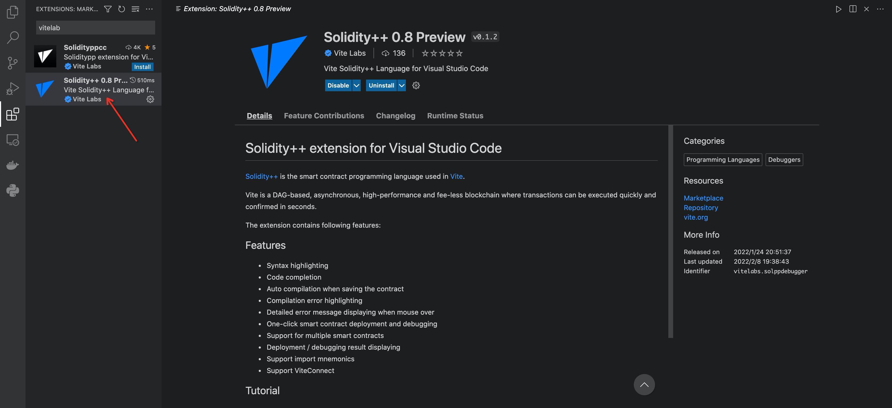
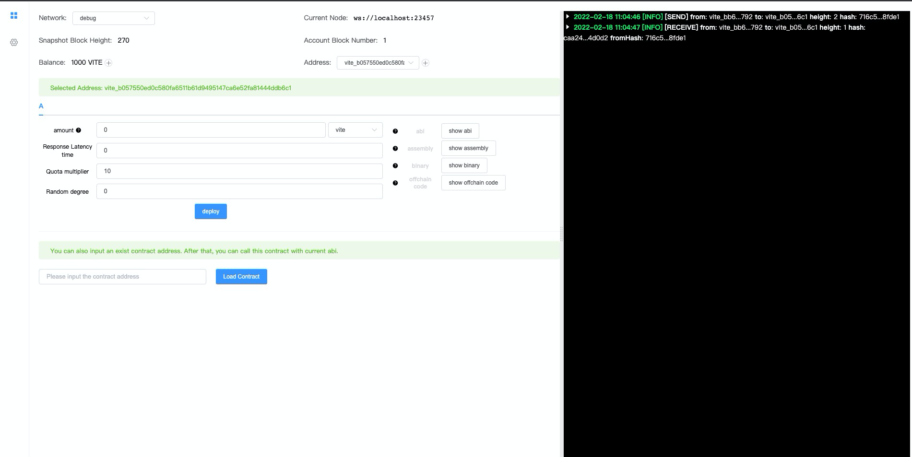
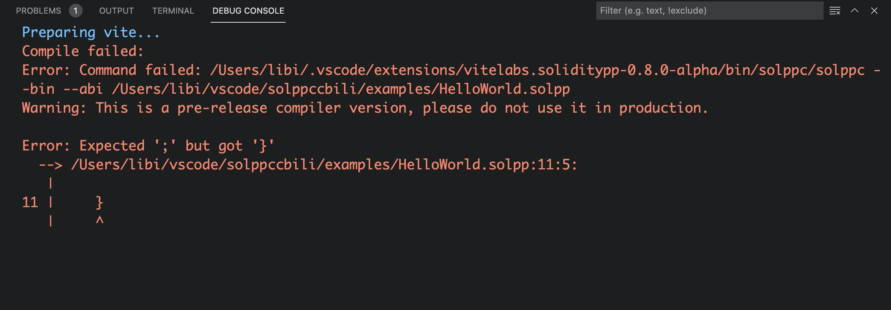
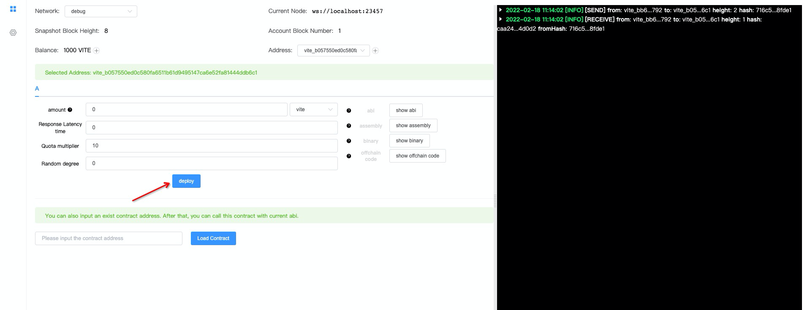
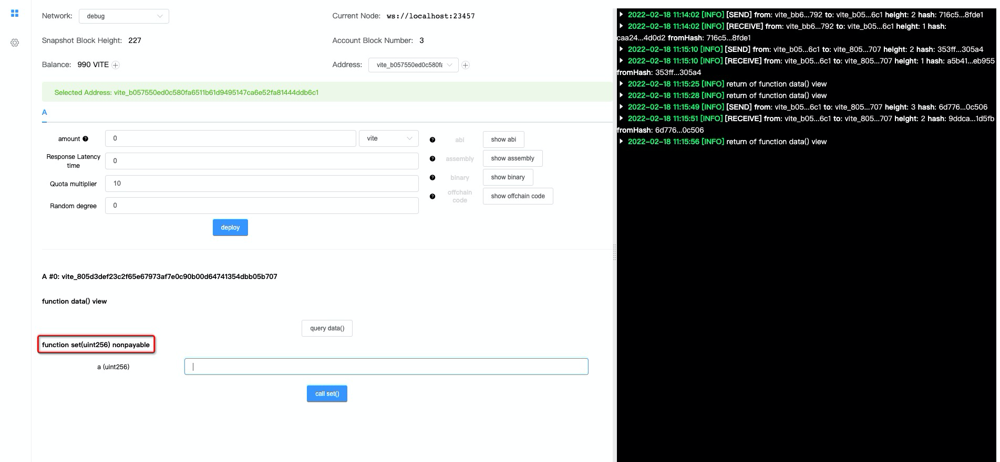
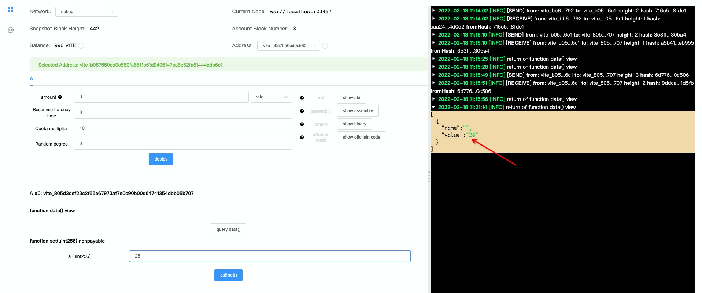

# How to Use

The recommended development environment for Solidity++ is Visual Studio Code with the Soliditypp extension, which includes a latest version of Vite node, a `solppc` compiler and debugging environment. 

## Install
Download and install [Visual Studio Code](https://code.visualstudio.com/)

Launch VSCode, navigate to the **Extensions** panel and search for "soliditypp", install the **Solidity++ 0.8 Preview** extension.


That's it! Now you can proceed to test your environment by deploying a contract.

:::tip Legacy Extension
At current time, two versions of solidity++ extension will be returned. If you are working with a 0.4.x Solidity++ contract, install **Solidityppcc**.
:::

## Write Contract

First create or specify a folder for your Solidity++ project.

Open the debug panel, and click on `create a launch.json file` link. 

Then choose **"Soliditypp"** for the environment.This automatically generates a `launch.json` file which is used by VSCode to configure the debugger.


Create a new file named `HelloWorld.solpp` and type in the following code:

```solidity
// SPDX-License-Identifier: GPL-3.0
pragma soliditypp >=0.8.0;

contract HelloWorld {
    uint public data = 123;

    function set(uint a) external {
        data = a; 
    }
}
```

The contract has a `set` function setting an input value `a` to public state field `data`.

> Note: Public field can be visited with an implicit view function in the same name. 

:::tip Generate Examples
The legacy extension provides a command to generate a `HelloWorld.solpp` contract by pressing `⇧⌘P` (on Mac) or `Ctrl+Shift+P` (on Windows) to open the Command Palette, then choosing the command `>soliditypp: Generate HelloWorld`. This has been replaced by `>soliditypp: Generate Examples` in extension Solidity++ 0.8.

You can also fetch the examples from https://github.com/vitelabs/soliditypp-examples
:::

## Debugging
Launch the debugger by pressing `F5`. This will automatically compile the contract and launch a debugger browser window. 

> Note: the extension will download `gvite` node for the first launch, stay patient!



:::tip Compiling Errors
If the debugger interface doesn't launch, check the debug console for any errors.
:::


:::tip Gvite Version
Since 0.2.5, it's possible to specify the gvite release version by adding `gviteVersion` in launch.json in your working directory as below.

```json
{
    "version": "0.2.0",
    "configurations": [
        {
            "type": "soliditypp",
            "request": "launch",
            "name": "Soliditypp Debug",
            "program": "${file}",
            "gviteVersion": "v2.12.0-nightly-202204012212"
        }
    ]
}
```
:::

## Deployment

To deploy your contract to the local (debug) node, simply hit on **Deploy** as shown below. There are several options available, let's use the default values here.



When the contract is deployed, a contract address will be displayed. We can call the contract now. 

The right side of the window shows the execution result logs.



Let's choose the function `set` and feed an integer, then click on the **call set()** button. When the log shows the "[RECEIVE]" transaction has been executed, hit the **query data()** button to check if the data field has been updated.


Congratulations! You've deployed and tested your first Solidity++ contract!
