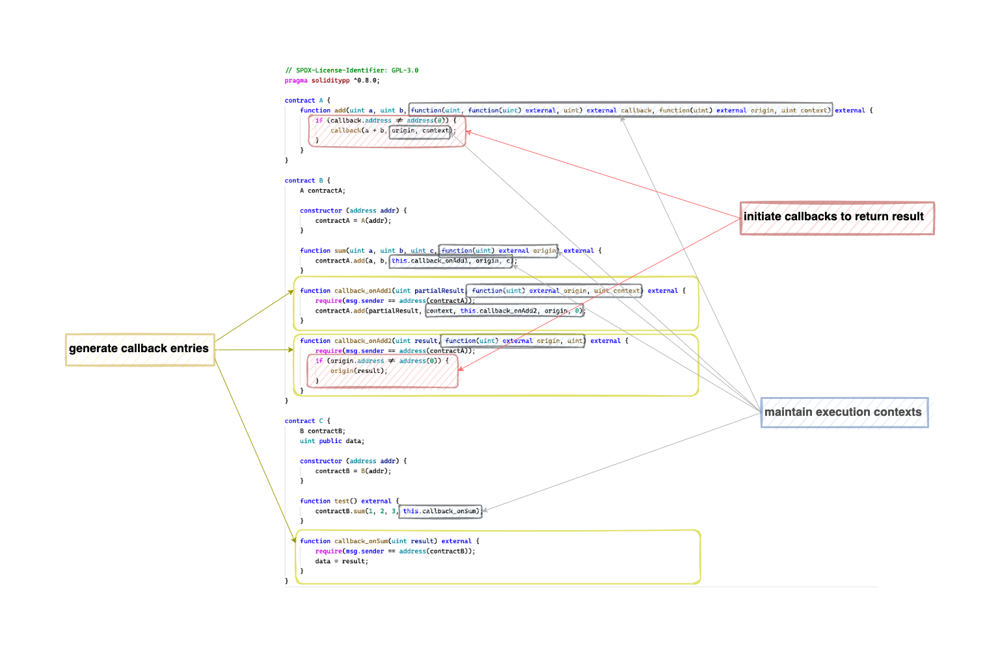
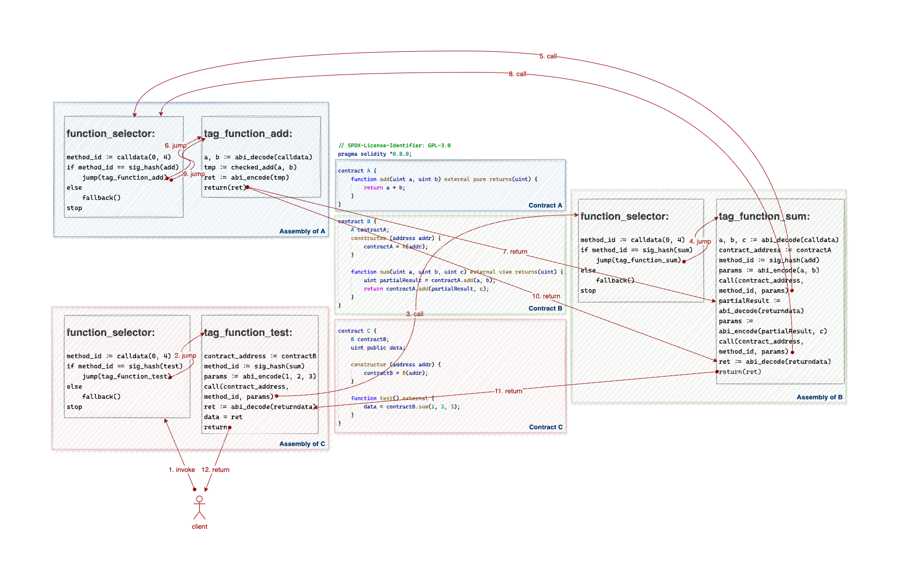
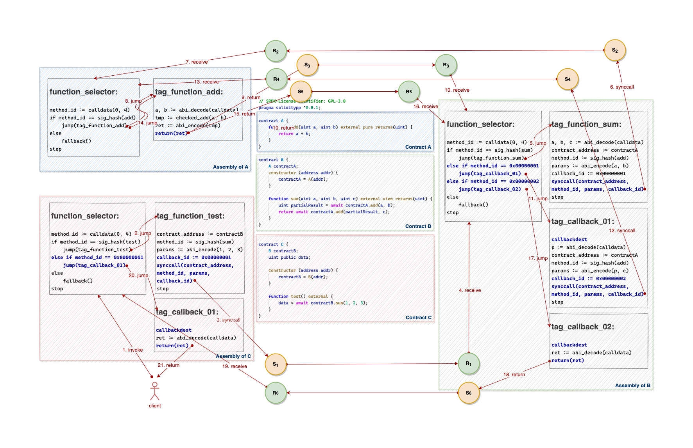
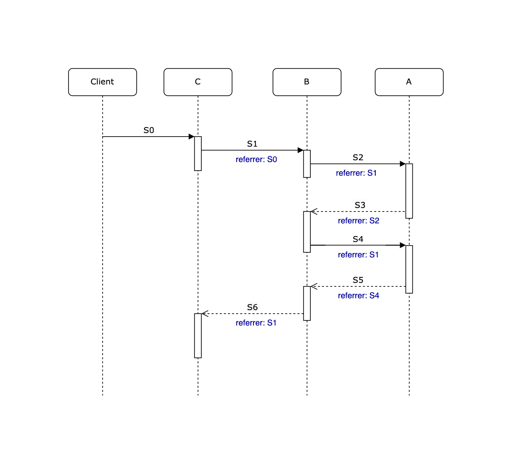

# Vite VM

Vite VM (Virtual Machine) retains the semantics of most EVM instructions, but is not a clone of EVM. Therefore, new instructions such as `synccall` and `callbackdest` need to be implemented from scratch, and some EVM instructions such as `return`, `returndatasize`, `returndatacopy` need to be reimplemented to adapt to the Vite protocol.

## Transaction Types
Three new transaction types are added in Vite VM:

- **SendSyncCall**: A send transaction initiated by a synchronous call,
- **SendCallback**: A send transaction initiated by a callback that successfully executes and returns a result.
- **SendFailureCallback**: A send transaction initiated by a callback that fails to execute and returns an error.

## Execution Context
Each transaction with one of the three new types contains an execution context data stored in the database.

The execution context is defined as follows:

```go
ExecutionContext {
	referrer types.Hash
	callback big.Int
	stack  []big.Int
	memory []byte
}
```

For a `SendSyncCall` transaction, its execution context includes:
- `referrer` holds the send transaction hash of the upstream (origin) sync call.
- `callback` holds the 4-bytes method id of the callback function entry.
- `stack` holds a snapshot of the contract stack at the time `synccall` is executed.
- `memory` holds a snapshot of the contract memory at the time `synccall` is executed.

For a `SendCallback` or a `SendFailureCallback` transaction, its execution context only includes a `referrer` field:
- `referrer` holds the send transaction hash of the latest sync call.

> Note: `referrer` could look a bit confusing, see the example below：


## SyncCall Instruction

The `synccall` instruction is implemented in pseudocode as follows:

```go
func opSynccall() {
	callback, toAddress, tokenID, amount, inOffset, inSize := vm.stack.pop(6)
	calldata := vm.mem.get(inOffset, inSize)

	if vm.Context.originSendBlock == nil {
		// upstream call
		origin := this.sendBlock
	} else {
		// load origin from VM context, it was saved by previous callbackdest
		origin := vm.Context.Origin
	}

	tx := ViteRequestTransaction {
		from: this.address,
		to: toAddress,
		type: SendSyncCall,
		value: amount,
		token: tokenID,
		data: calldata
		executionContext: ExecutionContext {
			referrer: origin.Hash,
			callback: callback,
			stack: vm.stack,
			memory: vm.memory,
		}
	}

	vite.trigger(tx)
}
```
## Return Instruction

The `return` instruction is implemented in pseudocode as follows:

```go
func opReturn() {
	offset, size := vm.stack.pop(2)
	ret := vm.mem.get(offset, size)

	sendType := this.sendBlock.BlockType
	// need to trigger a callback transaction
	if sendType == SendSyncCall || sendType == SendCallback || sendType == SendFailureCallback {
		// get the send-block of the original call
		if vm.Context.Origin == nil {
			// the return statement is not in a callback function
			// so origin is the latest send transaction
			origin := this.sendBlock
		} else {
			// the return statement is in a callback function
			// load origin from VM context, it was saved by previous callbackdest
			origin := vm.Context.Origin
		}

		if origin.BlockType == SendSyncCall {
			callback := origin.executionContext.callback
			// calldata of the callback: [callback_id][return_data]
			data := concat(callback, ret)

			tx := ViteRequestTransaction {
				from: this.address,
				to: origin.address,
				type: SendCallback,
				data: data,
				executionContext: ExecutionContext {
					referrer: origin.Hash,
				}
			}

			vite.trigger(tx)
		}
	}
}
```

## CallbackDest Instruction

The `callbackdest` instruction is implemented in pseudocode as follows:

```go
func opCallbackDest() {
	sendType := this.sendBlock.BlockType
	if sendType == SendCallback || sendType == SendFailureCallback {
		referrer := this.sendBlock.executionContext.referrer

		// validate sync call send block
		if referrer.address != this.address || referrer.ToAddress != this.sendBlock.address {
			return nil, error
		}

		// get upstream origin send block
		origin := referrer.executionContext.referrer

		// validate origin send block
		if origin.ToAddress != this.address {
			return nil, error
		}

		// save origin send block to VM context
		vm.Context.Origin = origin

		// restore stack
		vm.stack = referrer.executionContext.stack

		// push success flag (act as RETURN instruction in EVM)
		if sendType == SendCallback {
			// push true
			stack.push(1)
		} else { // sendType == SendFailureCallback
			// push false
			stack.push(0)
		}

		// restore memory
		vm.memory = referrer.executionContext.memory
	}
}
```

## Advanced example

<details>
  <summary>Show</summary>

### Objectives



### Solidity Compiler and EVM

Pseudo assembly code for contract `A`:
```
function_selector:
method_id := calldata(0, 4)
if method_id == sig_hash(add)
    jump(tag_function_add)
else
    fallback()
stop

tag_function_add:
a, b := abi_decode(calldata)
tmp := checked_add(a, b)
ret := abi_encode(tmp)
return(ret)
```

Pseudo assembly code for contract `B`:
```
function_selector:
method_id := calldata(0, 4)
if method_id == sig_hash(sum)
    jump(tag_function_sum)
else
    fallback()
stop

tag_function_sum:
a, b, c := abi_decode(calldata)
contract_address := contractA
method_id := sig_hash(add)
params := abi_encode(a, b)
call(contract_address, method_id, params)
partialResult := abi_decode(returndata)
params := abi_encode(partialResult, c)
call(contract_address, method_id, params)
ret := abi_decode(returndata)
return(ret)
```

Pseudo assembly code for contract `C`:
```
function_selector:
method_id := calldata(0, 4)
if method_id == sig_hash(test)
    jump(tag_function_test)
else
    fallback()
stop

tag_function_test:
contract_address := contractB
method_id := sig_hash(sum)
params := abi_encode(1, 2, 3)
call(contract_address, method_id, params)
ret := abi_decode(returndata)
data = ret
return
```



### Solidity++ Compiler

Pseudo assembly code for contract `A`:
```
function_selector:
method_id := calldata(0, 4)
if method_id == sig_hash(add)
    jump(tag_function_add)
else
    fallback()
stop

tag_function_add:
a, b := abi_decode(calldata)
tmp := checked_add(a, b)
ret := abi_encode(tmp)
return(ret)
```

Pseudo assembly code for contract `B`:
```
function_selector:
method_id := calldata(0, 4)
if method_id == sig_hash(sum)
    jump(tag_function_sum)
else if method_id == 0x00000001
    jump(tag_callback_01)
else if method_id == 0x00000002
    jump(tag_callback_02)
else
    fallback()
stop

tag_function_sum:
a, b, c := abi_decode(calldata)
contract_address := contractA
method_id := sig_hash(add)
params := abi_encode(a, b)
callback_id := 0x00000001
synccall(contract_address, method_id, params, callback_id)
stop

tag_callback_01:
callbackdest
p := abi_decode(calldata)
contract_address := contractA
method_id := sig_hash(add)
params := abi_encode(p, c)
callback_id := 0x00000002
synccall(contract_address, method_id, params, callback_id)
stop

tag_callback_02:
callbackdest
ret := abi_decode(calldata)
return(ret)
```

Pseudo assembly code for contract `C`:
```
function_selector:
method_id := calldata(0, 4)
if method_id == sig_hash(test)
    jump(tag_function_test)
else if method_id == 0x00000001
    jump(tag_callback_01)
else
    fallback()
stop

tag_function_test:
contract_address := contractB
method_id := sig_hash(sum)
params := abi_encode(1, 2, 3)
callback_id := 0x00000001
synccall(contract_address, method_id, params, callback_id)
stop

tag_callback_01:
callbackdest
ret := abi_decode(calldata)
return(ret)
```



### Vite VM



</details>
