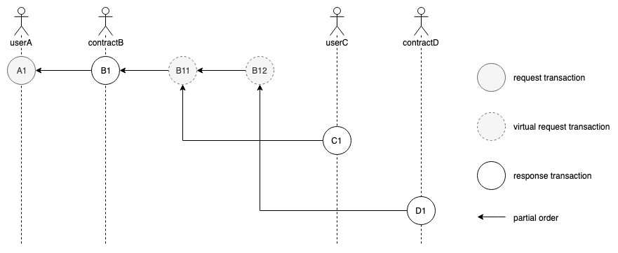

# Request / Response Model

Vite's asynchronous design mainly lies in three aspects.

- Asynchronous request and response
- Asynchronous transaction writing and confirmation
- Asynchronous communication between smart contracts

Here we focus on the first aspect.

The typical model for devices communicating on a network is request-response. In the request-response model, a client requests data, and a server responds to the request by providing the data. The same concept applies to Vite and Solidity++ just with slightly different terms.

## Transactions

Transactions on Vite can be categorized as request (send) transactions and response (receive) transactions. We distinguish between the following scenarios:

- Token Transfer: User ⇋ User
  - a user address sends funds to another user address
- Contract invocation: User ⇋ Contract or Contract ⇋ Contract
  - a user address invokes a function of a contract address
  - a contract address invokes the function of another contract address

Regardless of the scenario, two successive transactions get generated on the ledger. Each transaction only affects the state of a single address and transactions do not interfere with one another, which improves throughput.

In most cases, a transaction refers to an account block on Vite.

## RS (Receive-Send) Blocks

A request transaction to a smart contract may change the status of multiple user accounts or contracts. Imagine a Tipbot contract which sends "small tips" to many addresses in one transaction. By design, many new request transactions should be created and sent out after the contract response is complete. However, as a result, this breaks ACID principles that a transaction must hold. To prevent this, [VEP-7](https://docs.vite.org/vite-docs/vep/vep-7.html) has been introduced to merge the in-contract request transactions into the original response as one whole transaction. The merged block contains a response transaction and multiple request transactions. We call such merged blocks as RS blocks.

As shown in the figure below, one request block A<sub>1</sub> and three response blocks B<sub>1</sub>, C<sub>1</sub> and D<sub>1</sub> are created, and the in-contract request block B<sub>11</sub> and B<sub>12</sub> are merged into B<sub>1</sub>, which is a RS block in fact.



RS block has the following benefits:

* ACID is guaranteed since the response transaction and in-contract request transactions are written into one block
* Duplicated data are removed since blocks are merged
* Request-response relationship is preserved since each in-contract request has independent transaction hash

## A Simple Solidity++ Contract

Let's have a look at a simple Solidity++ example:

```solidity
// SPDX-License-Identifier: GPL-3.0
pragma soliditypp >=0.8.0 <0.9.0;

contract SimpleStorage {
    uint public storedData = 2;

    function get() external view returns (uint) {
        return storedData;
    }
}
```

As above, the way of declaring a contract is syntactically similar to Solidity.

The first line tells you that the source code is licensed under the GPL version 3.0.

The next line specifies that the source code is written for Solidity++ version 0.8.0, or a newer version of the language up to, but not including version 0.9.0. This is to ensure that the contract is not compilable with a new (breaking) compiler version, where it could behave differently.
The only difference with Solidity is to replace `solidity` with `soliditypp`.

Coming back to the request-response and client-server model, a client can invoke the `get()` function and the server (contract) will return the value of `storedData` which is equal to 2.

Because `storedData` is annotated with the `public` keyword, a getter function will be auto-generated by the compiler. As a result, this example contract allows to retrieve the value of `storedData` in 2 different ways.
