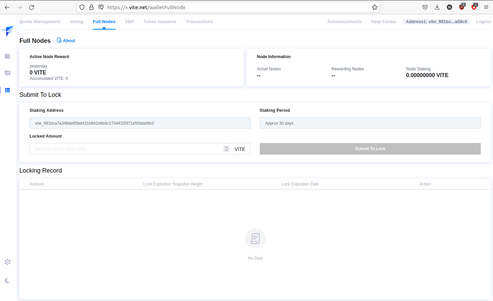
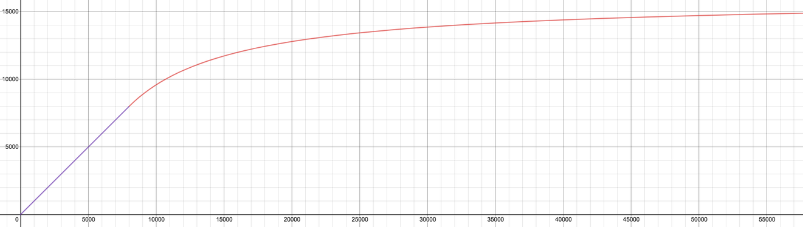
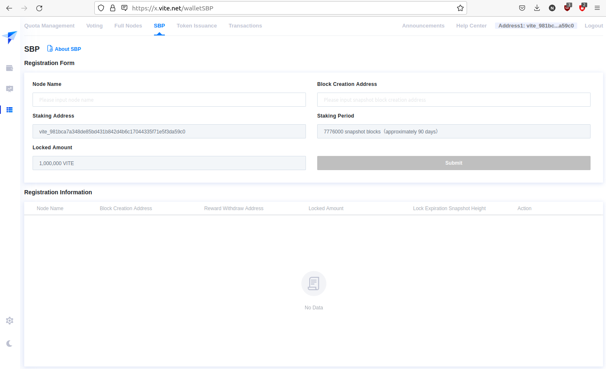

# Nodes

## Full Node

In Vite network, a full node is responsible for maintaining a complete copy of ledger, sending or receiving transactions, and verifying all transactions in the network. Full nodes can also participate in SBP election and voting. A full node can expose HTTP/WebSocket APIs externally and has a command line interface locally.

### Registration

Registering a full node is permission-less. The registration address shall have **10,000 VITE** for staking, then send a [registration transaction](https://x.vite.net/walletFullNode) and wait until the transaction is confirmed.

The 10k VITE will be locked up for **30 days (2592000 snapshot blocks)**.

After the lock-up period expires, the node owner (registration address) can cancel the registration and retrieve the locked fund through a Cancel Registration transaction. The cancelled full node will be removed from the network list after the transaction is confirmed. 

For safety purpose, node owners are recommended to use 2 separate Vite addresses for registration and withdrawing rewards respectively.

### Rewards

* A Snapshot Block Producer (SBP) named "FullNode.Pool" has been set up and maintained by Vite Labs. It is backed by 10 million VITE votes from the Vite Foundation. All income for "FullNode.Pool", including block creation rewards and voting rewards, will be shared with all eligible full nodes.
* The size of the full node rewards pool varies on a daily basis. It will determine the incentives provided by the Vite Foundation. The calculation is as follows:
    1. On a daily basis, when the size of the full node rewards pool ( x ) is no more than 8,000 VITE, an equal mount will be provided by the Vite Foundation. 
    $$y=x \left\{ 0 \leq x \leq 8000 \right\}$$
    2. On a daily basis, when the size of the full node rewards pool ( x ) is above 8,000 VITE, the incentives are determined by the following equation.
    $$y=\left( x - 8000 \right) \times \frac{8000}{x} + 8000 \left\{ x \gt 8000 \right\}$$
* Rewards will be shared equally by all live (uptime is above 90%) full nodes in the pool.

The following graph provides a visualization on how incentives are calculated.

For more details please refer to [Announcement of Full Node Reward Upgrade](https://medium.com/vitelabs/vite-incentive-plan-full-node-reward-program-upgrade-c6e96c6405bb).

::: warning Distinct IP Required
Note that if multiple full nodes run with the same IP address, only one node can get rewards. Do NOT setup your nodes with the same IP address! 
:::

## Snapshot Block Producer

A Snapshot Block Producer (SBP) is a delegated node in the Vite network. The primary function of SBP is to secure the network by producing snapshot blocks that store a state snapshot of the Vite ledger. This includes the balance of the account, the Merkle root of the contract state, and the hash of the last block of each account chain. To find out how an SBP works, please refer to [Consensus](../consensus/snapshot-block-producer.md#how-an-sbp-works).

:::tip
Before you continue reading, please see the [setup guide](./setup.md) on how to install gvite.
:::

### Configuration

Create a wallet as explained [here](./rpc-ipc.md#create-wallet) and append 4 properties in **node_config.json**

* Set `Miner` as `true`
* Set `CoinBase` in format of `index:address`. For example: `0:vite_f1c2d944b1e5b8cbfcd5f90f94a0e877beafeced1f331d9acf`.
* Set `EntropyStorePath` as your mining address. For example: `vite_f1c2d944b1e5b8cbfcd5f90f94a0e877beafeced1f331d9acf`.
* Set `EntropyStorePassword` as your keystore password corresponding to above address.

### Registration

:::tip
Registering a new SBP requires staking 1,000,000 VITE. Please ensure you have the amount in your account.
:::

Log in [Vite Web Wallet](https://x.vite.net/) and navigate to **SBP Registration** page.

Fill in **Node Name** and **Block Creation Address**. 

Please note that **Block Creation Address** is the CoinBase address you configured above and is only responsible for producing new blocks. Do NOT use your **Staking Address** as **Block Creation Address**.

After registration of the SBP, you may change the reward withdraw address in the following screens.

**SBP Name**

Please choose your SBP name carefully. Once registered the SBP name cannot be changed anymore. Use an interesting name to gain recognition from the community and draw votes.

**SBP Ranking List**

Visit [https://vitescan.io/sbps](https://vitescan.io/sbps) for the ranking list.
